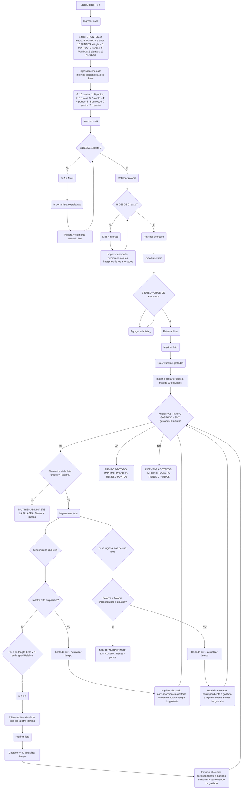

# THE LAST DANCE 

[](https://postimg.cc/BXStfPGW)

## Integrantes

## Miguel Angel Acevedo Olaya
## Juan Andrés Valderrama Parra


### Proyecto final progamacion de computadores 2023-2 UNAL: Jueguito del ahorcado

Como grupo hemos decidido como proyecto final hacer un juego del famosisimo juego de "el ahorcado", el cual todos jugabamos de peques cuando la vida era bella y nuestra diversion no se limitaba ahora solo a un dispositivo electrónico. Ironicamente, lo vamos a traer a planos digitales bajo progamación y para jugarlo en un dispositivo electrónico (procedo a xdxdd).

Para la realización de este juego lo compusimos bajo estos factores indispensables para la realización del juego

- Importe de librerias
- Instrucciones y niveles de juego
- Puntuación
- Listado de palabras a jugar
- Limite de tiempo
- Imagen de muñequito siendo ahorcado
- Juego final
- ¿Como jugarlo e instalarlo?

## DIAGRAMA DE FLUJO

### PARA UN JUGADOR


### PARA DOS JUGADORES

```mermaid
flowchart TD
    A[JUGADORES = 2] --> AP{I DESDE 0 hasta 5}
    AP-->|V| AQ{i%2 + 1 = 1?}
    AQ-->|SI| AR(JUGADOR 1)
    AQ -->|NO| AS(JUGADOR 2)
    AR --> B
    AS-->B(Ingresar nivel)
    B --> C(1 facil: 3 PUNTOS, 2 medio: 5 PUNTOS, 3 dificil: 10 PUNTOS, 4 ingles: 5 PUNTOS, 5 frances: 8 PUNTOS, 6 aleman: 10 PUNTOS)
    C --> D(Ingresar número de intentos adicionales, 3 de base)
    D --> E(0: 10 puntos, 1: 8 puntos, 2: 6 puntos, 3: 5 puntos, 4: 4 puntos, 5: 3 puntos, 6: 2 puntos, 7: 1 punto)
    E --> F(Intentos += 3)
    F --> G{A DESDE 1 hasta 7}
    G -->|V| H(SI A = Nivel)
    H --> I(Importar lista de palabras)
    I --> J(Palabra = elemento aleatorio lista)
    J --> G
    G -->|F| K(Retornar palabra)
    K --> L{B DESDE 0 hasta 7}
    L -->|V| M(SI B = Intentos)
    M --> N(Importar ahorcado, diccionario con las imagenes de los ahorcados)
    N --> L
    L -->|F| Ñ(Retornar ahorcado)
    Ñ --> O(Crea lista vacia)
    O --> P{B EN LONGITUD DE PALABRA}
    P -->|V| Q(Agregar a la lista _ )
    Q --> P
    P -->|F| R(Retornar lista)
    R --> S(Imprimir lista)
    S --> T(Crear variable gastados)
    T --> U(Iniciar a contar el tiempo, max de 90 segundos)
    U --> V{MIENTRAS TIEMPO GASTADO < 90 Y gastados < Intentos}
    V -->|SI| AD{Elementos de la lista unidos = Palabra?}
    AD -->|SI| AE(MUY BIEN ADIVINASTE LA PALABRA, JUGADOR X ha sumado Y puntos)
    AD --> |NO| W(Ingresa una letra)
    W --> AB{Si se ingresa una letra}
    AB --> AC{La letra esta en palabra?}
    AC -->|SI| AI{For c en longitd Lista y d en longitud Palabra}
    AI -->|V| AJ( si c = d)
    AJ --> AK(Intercambiar valor de la lista por la letra ingresa)
    AK --> AL(Imprimir lista)
    AL --> AM(Gastado += 0, actualizar tiempo)
    AM --> AN(Imprimir ahorcado, correspondiente a gastado e imprimir cuanto tiempo ha gastado)
    AN --> V
    AC -->|NO| AF(Gastado += 1, actualizar tiempo)
    AF --> AH(Imprimir ahorcado, correspondiente a gastado e imprimir cuanto tiempo ha gastado)
    AH --> V
    W -->X{Si se ingresa mas de una letra}
    X -->Y{Palabra = Palabra ingresada por el usuario?}
    Y -->|SI| Z(MUY BIEN ADIVINASTE LA PALABRA)
    Y -->|NO| AA(Gastado += 1, actualizar tiempo)
    AA --> AG(Imprimir ahorcado, correspondiente a gastado e imprimir cuanto tiempo ha gastado)
    AG --> V
    V -->|NO| AÑ(TIEMPO AGOTADO, IMPRIMIR PALABRA, JUGADOR X ha sumado 0 puntos)
    V -->|NO| AO(INTENTOS AGOTADOS, IMPRIMIR PALABRA, JUGADOR X ha sumado 0 puntos)
    AP -->|F| AT{Puntos jugador > 1 Puntos Jugador 2}
    AT -->|SI| AU(JUGADOR 1 HA GANADO)
    AT -->|NO| AV{Puntos jugador < 1 Puntos Jugador 2}
    AV -->|SI| AW(JUGADOR 2 HA GANADO)
    AV -->|NO| AX(EMPATE) 
```



## Importe de librerias

Para el despliegue adecuado de nuestro codigo, importamos "random", "unicodedata" y "time", ya que estos nos sentaron las bases para un uso indicado del juego

* Random permite sacar los elementos aleatorios, en este caso de las listas de palabras.
* Unicodedata permite quitarle las tildes a las palabras que estan en la lista, siendo de gran utilidad para permitir mejor interacción de juego
* Time es el que permite la creación del contador de tiempo

```

import random
import unicodedata
import time

```
## Elección de uno o dos jugadores

Le damos la opción al usuario de elegir que tipo de juego quiere, si ingresa 1 sera de un jugador, dos sera de dos jugadores, pero si ingresa otro valor, continuara preguntandole que modo de juego prefiere

```
bandera = True
while bandera == True:
  jugadores = int(input("QUIERES 1 O 2 JUGADORES: \n"))
  if jugadores == 1 or jugadores == 2:
    break
  else: (print("INGRESA ENTRE 1 Y 2"))

```

# UN JUGADOR 

## Instrucciones y nivel de juego

El juego es como el de toda la vida: Hay una palabra oculta del cual tiene que adivinarse mediante el acierto de letras que van redescubriendo dicha palabra, de lo contrario bajo una cantidad minima de 3 (y que el mismo usuario puede aumentar si desea)  de intentos fallidos, el juego acabara.

Hemos destinado 6 niveles de dificultad elegidos a gusto del jugador. Su dificultad radicara en la cantidad de letras de la que este compuesta dicha palabra y/ su idioma en el que este predispuesta. 

Dichos niveles enfatizados mejor seria asi:

### Nivel 1: Vamos con primeros pasos
Palabras en español que contengan entre 2 a 4 letras

### Nivel 2: Vamos con primiparo
Palabras en español que contengan entre 5 a 8 letras

### Nivel 3: Vamos con maestro 
Palabras en español que contengan mas de 8 letras

### Nivel 4: Let´s do IT
Palabras en inglés de 3 letras o mas

### Nivel 5: Quelle élégance de France
Palabras en francés de 4 letras o mas

### Nivel 6: Das ist Liebe Essen von Scheiße
Palabras en alemán de 4 letras o mas


Ya con los parametros y las instrucciones bien definidas y establecidas, se traslada a lenguaje de progamación en el cual se le da la posibilidad que el usuario el nivel de juego a su gusto:

La función nivel, nos permite dar al usuario la libertad de elegir el nivel con el que desea jugar, funciona con un input y un ciclo en el que si el valor no esta en el rango que le solicitamos, seguira ejectuandose.

La función intentos, cumple exactamente la misma función que la anterior, pero en vez de elegir nivel, esta elegira el número de intentos que tiene el usuario
```
def nivel(): # Función nivel
  print("HOLA BIENVENIDO A AHORCADO CON ANONIMUS CON H, SOMOS UN DUO DE PRIMIPAROS EL CUAL CREO ESTE JUEGO, COPUESTO DE 4 NIVELES, 3 BONOS DE IDIOMAS, Y \nLA CAPACIDAD DE ELEGIR EL NÚMERO DE INTENTOS, PROBAREMOS SI ERES UN PRO O UN SIMPLE PRIMIPARO QUE AUN NO CONOCE DEL MUNDO DE PYTHON \n")
  print("Estos son los niveles: \nNivel 1 = Primeros pasos PUNTOS : 3 \nNivel 2 = Primiparo PUNTOS: 5 \nNivel 3 = Maestro PUNTOS: 10  \nBonus 1 = Ingles PUNTOS: 5 \nBonus 2 = Frances PUNTOS: 8 \nBonus 3 = Aleman PUNTOS: 10 \n")
  bandera = True
  while bandera == True:
    nivel_Palabras = int(input("Escoge el nivel de las palabras que quieras (solo pon el número, 1 FACIL, 2 MEDIO, 3 DIFICL, si es bonus 1 = 4, bonus 2 = 5, bonus 3 = 6): ")) # Ingrese nivel
    if nivel_Palabras in range(1,7):
      break
    else:
      print("Eso no te lo puede dar, ingresa entre 1 y 6") # En caso de que no ingrese lo que desee
  return nivel_Palabras

def intentos():
  bandera = True
  while bandera == True:
    print("SIN CONTAR LOS EXTRA \n1 INTENTO: 1 PUNTO \n2 INTENTOS: 2 PUNTOS \n3 INTENTOS: 3 PUNTOS \n4 INTENTOS: 4 PUNTOS \n5 INTENTOS: 6 PUNTOS \n6 INTENTOS: 8 PUNTOS \n7 INTENTOS: 10 PUNTOS")
    num_intentos = int(input("Escoge el número de intentos,min 1, max 7 (TIENES 3 INTENTOS EXTRA DE BASE,): ")) # Ingreso de Intentos
    if num_intentos in range(1,8):
      break
    else:
      print("Eso no te lo puedo dar, ingresa entre 1 y 7") # En caso de que no ingrese lo que desee
      continue
  num_intentos = num_intentos + 3
  print("Tu número de intentos sera: " +str(num_intentos)+ "\n")
  return num_intentos

```

## Puntuaciones

Bien sea para el nivel de un jugador, o 2 jugadores(porque si, tenemos multijugador OOMMGGGG), el elixir y quien se llevara la copa Piston es aquel que logre la increible hazaña de encontrar la palabra indicada en el menor nÚmero de intentos posible.

Todos los jugadores contaran con una cantidad base de intentos de solamente 3. Previo a la partida se le dara la opción a que el jugador pueda aumentar el número de intentos, pero eso lo volveria mas noob y por ende la cantidad de puntos disminuye paulatinamente. La pertenencia de puntos en función de la cantidad de intentos adicionales seria asi:

### INTENTOS BASE: 3 ----> 10 PUNTOS
#### 1 INTENTO EXTRA: 8 PUNTOS
#### 2 INTENTOS EXTRA: 6 PUNTOS
#### 3 INTENTOS EXTRA: 5 PUNTOS
#### 4 INTENTOS EXTRA: 4 PUNTOS
#### 5 INTENTOS EXTRA: 3 PUNTOS
#### 6 INTENTOS EXTRA: 2 PUNTOS
#### 7 INTENTOS EXTRA: 1 PUNTO

Tambien los nivelitos tendran punticos, pilas ahi

#### Nivel 1: 3 puntos
#### Nivel 2: 5 puntos
#### Nivel 3: 10 puntos
#### Nivel 4: 5 puntos
#### Nivel 5: 8 puntos
#### Nivel 6: 10 puntos

En esta Función podemos ver que dependiendo del nivel y del número de intentos que eligio el usuario esta retornara un número de puntos determinado. 

```
  def puntos():  # Da los puntos
    if nivel_ == 1:
      punto_niv = 3
    elif nivel_ == 2:
      punto_niv = 5
    elif nivel_ == 3:
      punto_niv = 10
    elif nivel_ == 4:
      punto_niv = 5
    elif nivel_ == 5:
      punto_niv = 8
    elif nivel_ == 6:
      punto_niv = 10
    if num_intento == 3:
      punto_int= 10
    if num_intento == 4:
      punto_int = 8
    elif num_intento == 5:
      punto_int = 6
    elif num_intento == 6:
      punto_int = 5
    elif num_intento == 7:
      punto_int = 4
    elif num_intento == 8:
      punto_int = 3
    elif num_intento == 9:
      punto_int = 2
    elif num_intento == 10:
      punto_int = 1
    total = punto_niv + punto_int # Suma los puntos de nivel + intentos
    return total
```
## Listado de palabras a jugar

Se seleccionaron manualmente un total de mas de 1000 palabras entre todos los niveles(mas de 300 palabras entre los niveles de español, y mas de 100 en los demás idiomas), enfrascados en sus respectivos niveles y de los cuales le daran ese atributo de siempre tener una palabra nueva por cada juego.

### Progamación:
(Cabe recalcar que la palabra a jugar se seleccionara a lo random de esta galaxia (pero pues en codigo, obvio))

Esta función dependiendo del nivel que ingreso el usuario, tomara una lista dadas las condiciones ya dichas, y tomara un elemento aleatorio de esta, utilizamos el unicodedata para quitarle tildes, y retornamos esta palabra que sera la que permitira ejecutar el juego

### Nivel 1: Vamos con primeros pasos

```
def palabra(): # Lista
  if nivel_ == 1: # Nivel 1
    print("Vamos con primeros pasos \n")
    lista = [
    "sol", "mar", "luz", "paz", "amor", "rey", "dia", "pan", "flor", "rio", "ojo", "pie", "voz", "hiel", "ley", "te", "rama" ,
    "lago", "mesa", "pato", "cama", "seda", "oro", "nuez", "pino", "ave", "sal", "miel", "cal", "risa", "lima", "vino", "foco" ,
    "ciel", "rana", "lomo", "aro" , "piso", "bote", "fila", "sapo", "gato", "lino", "seta", "tiza", "lobo", "rudo", "lira", "bajo" ,
    "roto", "lago", "puma", "polo", "lima", "lila", "rico", "hueso", "aula", "coco", "bote", "lazo", "lava", "lona", "kilo", "lote", "codo" ,
    "vela", "alto", "rizo", "mora", "sala", "masa", "pila", "taco", "goma", "lima", "luna", "rizo", "lata", "sapo", "rama", "taza","pico",
    "pala" ,"puma", "casa", "vaso", "cima", "tira", "tiro", "mimo", "masa", "rito", "tono", "pesa", "rota", "ropa", "piso", "oso", "alma",
    "gira", "cero", "tela", "hilo", "pera", "tono", "cuna", "saco", "mesa", "cosa", "lado", "pez", "hora", "sola", "tiro", "lupa", "cita",
    "vaso", "rizo", "copa", "vela", "raso", "tapa", "polo", "lote", "lobo", "rato", "rata", "roca", "pila", "lago", "limo", "tira", "rima",
    "tasa", "sopa", "palo", "vino", "lira", "lava", "loma", "puma", "tren", "lira","riel","sosa", "rito", "vaso", "poco", "lazo", "cosa",
    "raso", "pera", "toro", "polo", "lote", "lobo", "pato", "rata", "roca", "pila", "lago", "limo", "tira", "rima", "tasa", "sopa", "palo",
    "vino", "lira", "lava"," loma", "peso", "tren", "lira", "piel", "sosa", "rito", "vaso", "poco", "lazo", "cosa", "raso", "pera", "toro",
    "polo", "lote", "lobo", "rato", "rata", "roca", "pila", "lago", "lima", "tira", "rima", "tasa", "sopa", "palo", "aire", "bote", "cebo",
    "dato", "eco", "fama", "giro", "halo", "idea", "jugo", "kaki", "lote", "masa", "nata", "onda", "paso", "queso", "raza", "seda", "taza",
    "uva", "vida", "wok", "yoga", "zumo", "arte", "boca", "cuna", "don", " eje", "foto", "gris", "hielo", "jarra", "kilo", "lola", "mito",
    "nudo", "oso", "pito", "queso", "rita", "saco", "tuna", "uso", "vela", "web", "yate", "zen", "ave", "bici", "codo", "cuco", "eros",
    "faro","gana", "hola", "jefe", "keko", "lata", "mimo", "nasa", "oro", "pavo", "quiz", "ropa", "sapo", "tajo", "unir", "vez", "wifi",
    "yodo", "zona", "acne", "bote", "cama", "duna", "eje", "foso", "gaza", "halo", "isla", "hale", "kiwi", "lara", "mesa", "nene", "opio",
    "pino", "dama", "rama", "sapo", "tapa", "uñas", "vino", "dedo", "yema", "zumo", "mama", "papa", "ají", "búho", "ceja", "duna", "eje",
    "feo", "gula", "hueso", "jota", "kiwi", "lira", "mole", "nodo", "peso", "rudo", "soso", "tito", "urna", "vale", "jugo", "café, ""aloe",
    "buda", "cima", "duo", "enea", "fofo", "gafe", "haba", "iman", "luca", "lata", "mina", "pavo", "riel", "saco", "tela", "uno", "buho",
    "paz""yama"
    ]
    elemento_aleatorio = random.choice(lista)
    elemento_aleatorio_ = ''.join((c for c in unicodedata.normalize('NFD', elemento_aleatorio) if unicodedata.category(c) != 'Mn'))
    return(elemento_aleatorio_)

```


### Nivel 2: Vamos con primiparo:

```
 if nivel_ == 2: # Nivel 2
    print("Vamos con Primiparo \n")
    lista = [
      "abrigo", "balero", "camino", "Detalle", "esfera", "fuerza", "gorila", "humano", "insecto", "jardin", "lapiz", "madera", "narco", "opalo",
      "pajaro", "quimera", "raton", "sabana", "temprano", "utero", "valvula", "xilofono", "yogurt", "zocalo", "afinar", "broche", "calmado",
      "dactil", "ebano", "fabula", "genero", "habito", "indice", "bodega", "lamina", "maquina", "nauseas", "pablo", "quorum", "rabano", "sadico",
      "ulcera", "vandalo", "zangano", "aereo", "barato", "cometa", "dorado", "estilo", "fiesta", "gracia", "hierro", "invierno", "juego", "kawasaki",
      "limon", "manzana", "numero", "olvido", "pezon", "queso", "reloj", "silla", "tiempo", "viento", "aceite", "broma", "cepillo", "dragon",
      "espejo", "frasco", "guitarra", "helado", "iman", "jirafa", "kiosco", "lenteja", "mueble", "naranja", "oruga", "platano", "querido", "resorte"
      "sarten", "tabaco", "util", "vuelo", "yerno", "zafiro", "amarillo", "bicicleta", "claridad", "drogado", "estampa", "fantasma", "gravilla",
      "halcon", "impacto", "jornada", "karate", "llanura", "maraton", "niquel", "octubre""ratente", "quimico", "resumen", "sinfonia", "trabajo",
      "uruguay", "ventana", "yerba", "zanahoria", "acelga", "bufalo", "cosecha", "decibel", "establo", "fabula", "habitante", "ilusion", "jengibre",
      "karaoke", "labrador", "maniaco", "nublado", "obraje", "parpado", "quebrada", "relieve", "salmon", "tabique", "ursula", "viaducto", "waffles",
      "alambre", "caracol", "delfin", "elefante", "frutal", "granero", "hormiga", "incienso", "jacinto", "kilovatio", "linterna", "monarca",
      "naranjo", "acelote", "paraguas", "quirofano", "reserva", "semilla", "telefono", "sombra", "ventilador", "xilografia", "zarcillo", "algodon",
      "brujula", "cenador", "dinosaurio", "escarola", "flamenco", "garganta", "hormigon", "indicador", "jalea", "laberinto", "marmol", "nectar",
      "obelisco""palanca""quimono""retablo""sinfonia""taburete""ulcera""vertigo", "yoduro", "zafiro", "bambu", "caramelo", "dinamita", "estrella",
      "fantasia", "girasol", "helice", "insignia", "jaleo", "kamikaze", "limonero", "maniquí", "nopal", "octagono", "pantera", "quijote",
      "rompecabezas", "sandwich", "taller", "umbra", "vivienda", "yacimiento", "zambomba", "almohada", "bazar", "carpeta", "dromedario", "establo",
      "felino", "gorrion", "helicoptero", "invernadero", "jeringa", "lider", "mariposa", "neumatico", "ovación", "pimienta", "rosaleda", "sardina",
      "terreno", "unicornio", "vainilla", "zapatilla", "alquiler", "bombilla", "clavel", "durazno", "esfera", "furgoneta", "gaviota", "hidrante",
      "infusión", "jazmin", "kilogramo", "linterna", "molino", "neblina""orquídea", "pizarra", "quimica", "rosquilla", "vanadio", "almendra",
      "boceto", "cosecha", "espejismo", "fandango", "gladiolo", "halogeno", "insular", "jocoso", "lombriz", "mochila", "navegador", "ostra",
      "picaporte", "quinoa", "rotonda", "surtidor", "uvula", "vagabundo", "yate", "zambullida", "acrobata", "claro", "bisturi", "cupula",
      "diadema", "enigma", "frijol", "gondola", "harina", "insecto", "jicara", "laser", "mascara", "nomada", "oculto", "paramo", "quiste", "rabano",
      "sotano", "túnel", "ultimo", "vastago", "zodiaco", "acrilico", "boveda", "cesped", "darsena", "ebano", "fosforo", "gargola", "heroe",
      "icaro", "jubilo", "latigo", "mastil", "nectar", "optica", "petalo", "quorum", "regimen", "subdito", "tempano", "unico", "vertice", "xilofono",
      "aereo""baculo""codigo"
    ]
    elemento_aleatorio = random.choice(lista)
    elemento_aleatorio_ = ''.join((c for c in unicodedata.normalize('NFD', elemento_aleatorio) if unicodedata.category(c) != 'Mn'))
    return(elemento_aleatorio_)

```

### Nivel 3: Vamos con maestro:

```
if nivel_ == 3: # Nivel 3
    print("Vamos con maestro \n")
    lista = [
  "abecedario", "biblioteca", "calefaccion", "democracia", "electricidad", "filosofia", "gastronomia", "hidratacion", "iluminacion",
  "jardineria", "kilometraje", "libreria", "matematicas", "neumatico", "orquesta", "paralelogramo", "querubines", "radiografia", "metalurgia",
  "telescopio", "ultrasonido", "vagabunderia", "ingenieria", "camioneta", "filosofia", "aprobacion", "arquitectura", "burocracia",
  "contaminacion", "desarrollo", "espectaculo", "fraternidad", "geografia", "horticultura", "imaginacion", "justificacion", "kinesiologia",
  "luminiscencia", "meteorologia", "navegacion", "oportunidad", "psicologia", "quimica", "revolucion", "reconocimiento", "traduccion",
  "universitario", "vulcanizacion", "antioquia", "zoologico", "aeronautica", "biologia", "cartografia", "dermatologia", "encefalograma",
  "filantropia", "gerontologia", "hidrografia", "iconografia", "jeringuilla", "levitacion", "monocromatico", "nefrologia", "oceanografia",
  "paleontologia", "quiropractica", "retroalimentacion", "sismología", "telepatia", "ultravioleta", "verborrea", "entropia", "coqueteria",
  "antagonismo", "balistica", "caligrafoa", "diagnóstico", "simbiosis", "filigrana", "glaciacion", "hemisferio", "ilusionismo", "jovialidad",
  "kinesioterapia", "locomoción", "magnetismo", "neurologia", "ornitología", "psicopatologia", "queratina", "reciclaje", "simbolismo",
  "teocracia", "unificacion", "ventilacion", "histeria", "xenofobo", "zoologia", "arqueologia", "bioquimica", "cinematografia",
  "deshidratacion", "epistemologia", "fisioterapia", "geriatria", "hemoglobina", "idealizacion", "logaritmo", "microscopio", "neurocirugia",
  "oftalmologia", "paleografia", "quiromancia", "radiotelescopio", "serpiente", "taxidermia", "cantautor", "escondidas", "xenofobia",
  "zambullirse", "autobiografia", "bacteriologia", "contabilidad", "desinfeccion", "electromagnetismo", "fotografia", "gramatica", "hipotenusa",
  "impresionismo", "jurisprudencia", "kinestesia", "litografia", "macadamia", "nostalgia", "oleografia", "fotografia", "quiroptero",
  "restauracion", "surrealismo", "television", "aristocracia", "beneficencia", "comunicacion", "deforestacion", "electrodomestico", "fotocopiadora", "gubernamental", "hemeroteca", "informatica", "jurisdiccion"
  "kilovoltio", "libreria", "neurociencia", "oftalmologo", "paramedico", "ginecoplastia", "resucitacion", "quirurgico", "ultrasonografia",
  "discoteca", "reggaeton", "yerbatero", "zambullidor", "automatizacion", "bioingeniería", "cronometraje", "desoxirribonucleico", "etnografía"
  "fonoaudiologia", "horticultor", "embriaguez", "jardineria", "kinesiologia", "lexicografia", "meteorologia", "nefrologia", "otorrinolaringologia",
  "petrografia", "quiropractica", "radiotelefonia", "sismografo", "toxicologia", "microscopio", "videocamara", "xenofobo", "yuxtaposicion",
  "zoologico", "antropologia", "biomecánica", "computadora", "dermatologia", "espectrofotometria", "filantropia", "hemodinamica", "inmunologia",
  "kilogramo", "laringologia", "micologia", "neumonia", "oftalmologia", "paleontologia", "quimioterapia", "radiactividad", "taquicardia",
  "ultravioleta", "virologia", "depresion", "zancadilla", "arqueologia", "progamacion", "cardiologia", "depuradora", "electroencefalograma",
  "geriatria", "hemoglobina", "infograma", "jardinería", "ludopatia", "microprocesador", "neurotransmisor", "psicopedagogía", "quebradizo",
  "radioastronomía", "semiótica", "terapia", "ultraligero", "ventriloquia", "zapatilla", "astronomia", "bronquitis", "caleidoscopio",
  "deshidratador", "electroimán", "fisiología", "gerontología", "hemisferio", "indemnizacion", "jeringuilla", "kinesioterapia", "logistica",
  "monocromático", "neurocirugia", "osteopatia", "psiquiatria", "quimico", "reciclador", "filologia", "transeúnte", "verosimilitud",
  "xilofono", "yerbatero", "zambullida", "antioxidante", "catapulta", "diagnóstico", "electroshock", "fraccionamiento", "astronauta",
  "intermediario", "jerarquía", "kinesiterapia", "luminiscencia", "magnetoscopio", "neuroanatomía", "oftalmoscopio", "farmacología", "acuicultura",
  "barometro", "camuflaje", "descifrador", "empatia", "fertilizante", "glucosa", "hidroelectrica", "justiciero", "karaoke", "laboratorio",
  "microscopio", "neurocirujano", "oftalmoscopio", "paracaidismo", "queratina", "radiacion", "sarcofago", "ultravioleta", "ventrilocuo",
  "xenofobia", "zangoloteo", "binocular", "ciberespacio", "desinfectante", "entrenador", "filosofar", "geotermia", "hormigon", "inmunologia",
  "jardinero", "caleidoscopio", "luminiscencia", "monocromatico", "navegante", "operacion", "paleontologo", "quimioterapia", "radiotelescopio",
  "secuenciador", "termometro", "urbanizacion", "viscosidad", "terremoto"
]
    elemento_aleatorio = random.choice(lista)
    elemento_aleatorio_ = ''.join((c for c in unicodedata.normalize('NFD', elemento_aleatorio) if unicodedata.category(c) != 'Mn'))
    return(elemento_aleatorio_)

```

### Nivel 4: Let´s do IT:

```
 if nivel_ == 4: # Nivel 4
    print("Let's do IT \n")
    lista = [
"cat", "dog", "bee", "run", "hat", "red", "sun", "box", "joy", "sky", "key", "car", "egg", "ice", "owl", "pen", "zip", "yoy", "fog", "wax",
"jet", "log", "mud", "nut", "pie", "rag", "sea", "van", "web", "zen", "air", "animal", "basket", "camera", "danger", "energy", "flower",
"garden", "health", "island", "jungle", "kettle", "ladder", "market", "nature", "orange", "palace", "quarry", "rescue", "spirit", "travel",
"unique", "wallet", "xyloph", "yellow", "accord", "breeze", "castle", "donate", "emblem", "flight", "gravel", "harbor", "injury", "jumper",
"adventure", "brilliant", "chocolate", "dangerous", "fantastic", "gratitude", "hospital", "important", "handsome", "knowledge", "landscape",
"machinery", "nutrition", "operation", "neumatic", "question", "radiology", "spherical", "telescope", "umbrella", "vibration", "warehouse",
"xenophobe", "zealously", "afternoon", "biography", "candidate", "education", "frequency", "generator", "marketing" , "nightfall",
"overboard", "wallpaper", "satellite", "underwear", "blueberry", "homework", "morning", "elephant"
     elemento_aleatorio = random.choice(lista)
     elemento_aleatorio_ = ''.join((c for c in unicodedata.normalize('NFD', elemento_aleatorio) if unicodedata.category(c) != 'Mn'))
     return(elemento_aleatorio_)
```

### Nivel 5: Quelle élégance de France:

```
 if nivel_ == 5: # Nivel 5
    print("Quelle élégance de France \n")
    lista = ["lundi", "mardi", "mercredi", "jeudi", "vendredi", "samedi", "dimanche", "automne", "hiver", "printemps", "pronunciaton","mois", "janvier", "mars", "avril", "mai", "juin", "juillet", "septembre", "octobre", "novembre", "decembre", "coleurs", "noir", "violet", "blanc", "rouge", "rose", "vert", "bleu", "orange", "marron", "gris", "beige", "turquoise", "famille", "soeur", "fils", "fille", "oncle", "tante", "cousine", "cousin", "enfants", "neveu","verbes", "avoir", "pronominaux", "aller", "manger", "courir", "danser", "chanter", "voler", "vouloir", "pouvoir", "garder", "jouer", "nager", "contruire", "penser", "ajouter", "sortir", "entrer", "monter", "descendre", "partir", "retourner", "rentrer", "rester", "tomber", "venir", "arriver", "mourir","permettre", "permis", "mettre", "mis", "dormir", "mentir", "sentir", "exprimer", "emotions", "hereuse", "triste", "aimer", "destester", "partager","rage" "servir", "sourire", "traduire", "conduire", "produire", "attendre", "battre", "animaux", "chien", "chat", "cheval", "souris", "poisson", "lion"]
    elemento_aleatorio = random.choice(lista)
    elemento_aleatorio_ = ''.join((c for c in unicodedata.normalize('NFD', elemento_aleatorio) if unicodedata.category(c) != 'Mn'))
    return(elemento_aleatorio_)

```

### Nivel 6: Das ist Liebe Essen von Scheiße:

```
  if nivel_ == 6: # Nivel 6
    print("Das ist Liebe zum Essen von Scheiße \n")
    lista = [
"haus", "baum", "auto", "weg", "zug", "hund", "katze", "jahr", "tag", "zeit", "mond", "sonne", "meer", "stadt", "berg", "buch", "boot",
"tur", "wand", "bett", "tisch", "stuhl", "licht", "lampe", "bild", "ring", "vogel", "blume", "fluss", "brot", "wein", "milch", "wasser",
"blumen", "fenster", "schrank", "brucke", "vogel", "schule", "kirche", "garten", "strabe", "insel", "freund", "lehrer", "familie", "teller",
"stuhl", "lampe", "buchen", "bilder", "wetter", "sonnen", "sterne", "wolken", "regnen", "schnee", "windig", "sommer", "winterhg",
"fruhling", "herbst", "wasser", "kaffee", "zucker", "pfanne", "messer", "krankenhaus", "universität", "bibliothek", "schokolade",
"geschichten", "wissenschaft", "elektrizität", "kindergarten", "schmetterling", "sonnenschein", "regenschirm", "fruhstück", "arbeitsplatz",
"geburtstag", "fahrradfahren", "geschwindigkeit", "gemusegarten", "feiertag", "Gluckwunsch", "handtuch", "instrument", "journalist",
"kaffeetasse", "landschaft", "mittagessen", "nachmittag", "organisation", "persönlichkeit", "qualifikation", "restaurant", "supermarkt",
"telefonnummer", "umweltschutz", "verantwortung"
]
    elemento_aleatorio = random.choice(lista)
    elemento_aleatorio_ = ''.join((c for c in unicodedata.normalize('NFD', elemento_aleatorio) if unicodedata.category(c) != 'Mn'))
    return(elemento_aleatorio_)

```
# Imágen muñequito siendo ahorcado 

Para ahorcar a nuestro muñequito, hay que embarrarla, es por eso que el espacio destinado para colocar las letras correctas estaran destinada por los caracteres:

```
['__ ']
```
Este caracter se acoplara en funcion de la cantidad de letras que se haya escogido para jugar, y que con cada acierto dicho caracter sea reemplazado con la letra que se debe

## EJEMPLO

```
Palabra buscada: AMA

['_ ', '_ ' , '_ ']

INGRESA UNA LETRA: a
    "a ES CORRECTO"
    "TE QUEDAN X INTENTOS


[' a ', '_ ', 'a ']

  "TE QUEDAN X SEGUNDOS"
 
INGRESA UNA LETRA: m
  "M ES CORRECTO"

['a ', 'm ', 'a ']

"HA FINALIZADO EL JUEGO"

```

Visto en el codigo del juego sería asi:

```
for u in range(len(ahorcado)):
if u == gastados:
    for v, w in ahorcado[u].items():
        print(w)

```


Ese es en el caso bonito, pero para casos contrarios, para aquellas ocasiones que no se acierte con la letra, no se reemplazara ningun caracater y se le informara a nuestros jugadores el limite de tiempo que queda y el número de intentos restantes.

## EJEMPLO

```

Palabra buscada: CAMA


['_ ', '_ ' , '_ ' , '_ ']

Ingresa una letra: e 
    "e ES INCORRECTO"
    "HAS GASTADO X INTENTOS, TE QUEDAN X"

...
```

El codigo es similar a cuando se acierta una palabra, bajo la diferencia de que se le incorpora un else con las palabras destinadas a este caso:

```
 else:
          upper = ingresa_.upper()
          print(str(upper)+ " ES INCORRECTO INTENTA NUEVAMENTE")
          contador = 0
          gastados += 1
          print("Has gastado " +str(gastados)+ " intentos, te quedan " +str(num_intento-gastados)+ "\n")
          print(str(lista)+ "\n")
        print("AHORCADO: \n")
```


Y es ahi cuando traeremos a nuestro tan universal e icónico mamarracho que nos remite a como desde la infancia nos instauran simbolos para nuestra caida progresiva al fracaso. Dicho mamarracho es este:


[](https://postimg.cc/TyXtCp0p)

Este mamarrachito esta conformado bajo una secuencia de caracteres ordenada para que conserve su iconica forma. Aun asi, esta progamado de tal manera que se dibujara en funcion de la cantidad de intentos que decidan nuestros jugadores. (Entre mas intentos se escoga, mas fragmentado sera nuestro mamarracho)

La función de la cual sacamos los muñequitos es la siguiente. Esta permite guardar en una lista, el diccionario con cada muñequito, que estan ordenados secuencialmente para encajarlos con el número de intentos gastados, ademas de eso dependiendo del número de intentos que ingreso el usuario, se tiene configurado que lista sera retornada, para que tenga coherencia.

```
  def img_ahoracado(): # AHORCADO
    if num_intento == 3: # CUANDO INGRESA 0
      ahorcado_ = [
          {
              '0': '    +---+',
              '1': '        |',
              '2': '        |',
              '3': '        |',
              '4': '        |',
              '5': '=========',
          },
          {
              '0': '    +---+',
              '1': '        |',
              '2': '        |',
              '3': '        |',
              '4': '        |',
              '5': '=========',
          },
          {
              '0': '    +---+',
              '1': '        |',
              '2': '        |',
              '3': '        |',
              '4': '        |',
              '5': '=========',
          },
          {
              '0': '    +---+',
              '1': '    |   |',
              '2': '    O   |',
              '3': '   /|\  |',
              '4': '   / \  |',
              '5': '=========',
              }
                ]
    elif num_intento == 4: # CUANDO INGRESA 1
      ahorcado_ = [
          {
              '0': '    +---+',
              '1': '        |',
              '2': '        |',
              '3': '        |',
              '4': '        |',
              '5': '=========',
          },
          {
              '0': '    +---+',
              '1': '        |',
              '2': '        |',
              '3': '        |',
              '4': '        |',
              '5': '=========',
          },
          {
              '0': '    +---+',
              '1': '        |',
              '2': '        |',
              '3': '        |',
              '4': '        |',
              '5': '=========',
          },
          {
              '0': '    +---+',
              '1': '        |',
              '2': '        |',
              '3': '        |',
              '4': '        |',
              '5': '=========',
          },
          {
              '0': '    +---+',
              '1': '    |   |',
              '2': '    O   |',
              '3': '   /|\  |',
              '4': '   / \  |',
              '5': '=========',
              }
                ]
    elif num_intento == 5:# CUANDO INGRESA 2
      ahorcado_ = [
          {
              '0': '    +---+',
              '1': '        |',
              '2': '        |',
              '3': '        |',
              '4': '        |',
              '5': '=========',
          },
          {
              '0': '    +---+',
              '1': '        |',
              '2': '        |',
              '3': '        |',
              '4': '        |',
              '5': '=========',
          },
          {
              '0': '    +---+',
              '1': '        |',
              '2': '        |',
              '3': '        |',
              '4': '        |',
              '5': '=========',
          },
          {
              '0': '    +---+',
              '1': '        |',
              '2': '        |',
              '3': '        |',
              '4': '        |',
              '5': '=========',
          },
          {
              '0': '    +---+',
              '1': '    |   |',
              '2': '    O   |',
              '3': '   /|\  |',
              '4': '        |',
              '5': '=========',
          },
          {
              '0': '    +---+',
              '1': '    |   |',
              '2': '    O   |',
              '3': '   /|\  |',
              '4': '   / \  |',
              '5': '=========',
              }
                ]
    elif num_intento == 6: # CUANDO INGRESA 3
      ahorcado_ = [
          {
              '0': '    +---+',
              '1': '        |',
              '2': '        |',
              '3': '        |',
              '4': '        |',
              '5': '=========',
          },
          {
              '0': '    +---+',
              '1': '        |',
              '2': '        |',
              '3': '        |',
              '4': '        |',
              '5': '=========',
          },
          {
              '0': '    +---+',
              '1': '        |',
              '2': '        |',
              '3': '        |',
              '4': '        |',
              '5': '=========',
          },
          {
              '0': '    +---+',
              '1': '        |',
              '2': '        |',
              '3': '        |',
              '4': '        |',
              '5': '=========',
          },
          {
              '0': '    +---+',
              '1': '    |   |',
              '2': '    O   |',
              '3': '    |   |',
              '4': '        |',
              '5': '=========',
          },
          {
              '0': '    +---+',
              '1': '    |   |',
              '2': '    O   |',
              '3': '   /|\  |',
              '4': '        |',
              '5': '=========',
          },
          {
              '0': '    +---+',
              '1': '    |   |',
              '2': '    O   |',
              '3': '   /|\  |',
              '4': '   / \  |',
              '5': '=========',
          }
      ]
    elif num_intento == 7: # CUANDO INGRESA 4
      ahorcado_ = [
          {
              '0': '    +---+',
              '1': '        |',
              '2': '        |',
              '3': '        |',
              '4': '        |',
              '5': '=========',
          },
          {
              '0': '    +---+',
              '1': '        |',
              '2': '        |',
              '3': '        |',
              '4': '        |',
              '5': '=========',
          },
          {
              '0': '    +---+',
              '1': '        |',
              '2': '        |',
              '3': '        |',
              '4': '        |',
              '5': '=========',
          },
          {
              '0': '    +---+',
              '1': '        |',
              '2': '        |',
              '3': '        |',
              '4': '        |',
              '5': '=========',
          },
          {
              '0': '    +---+',
              '1': '    |   |',
              '2': '    O   |',
              '3': '        |',
              '4': '        |',
              '5': '=========',
              },
          {
              '0': '    +---+',
              '1': '    |   |',
              '2': '    O   |',
              '3': '    |   |',
              '4': '        |',
              '5': '=========',
              },
          {
              '0': '    +---+',
              '1': '    |   |',
              '2': '    O   |',
              '3': '   /|\  |',
              '4': '        |',
              '5': '=========',
              },
          {
              '0': '    +---+',
              '1': '    |   |',
              '2': '    O   |',
              '3': '   /|\  |',
              '4': '   / \  |',
              '5': '=========',
              }
      ]
    elif num_intento == 8: # CUANDO INGRESA 5
      ahorcado_ = [
        {
            '0': '    +---+',
            '1': '        |',
            '2': '        |',
            '3': '        |',
            '4': '        |',
            '5': '=========',
        },
        {
              '0': '    +---+',
              '1': '        |',
              '2': '        |',
              '3': '        |',
              '4': '        |',
              '5': '=========',
          },
          {
              '0': '    +---+',
              '1': '        |',
              '2': '        |',
              '3': '        |',
              '4': '        |',
              '5': '=========',
          },
          {
              '0': '    +---+',
              '1': '        |',
              '2': '        |',
              '3': '        |',
              '4': '        |',
              '5': '=========',
          },
        {
            '0': '    +---+',
            '1': '    |   |',
            '2': '        |',
            '3': '        |',
            '4': '        |',
            '5': '=========',
        },
        {
            '0': '    +---+',
            '1': '    |   |',
            '2': '    O   |',
            '3': '        |',
            '4': '        |',
            '5': '=========',
        },
        {
            '0': '    +---+',
            '1': '    |   |',
            '2': '    O   |',
            '3': '    |   |',
            '4': '        |',
            '5': '=========',
        },
        {
            '0': '    +---+',
            '1': '    |   |',
            '2': '    O   |',
            '3': '   /|\  |',
            '4': '        |',
            '5': '=========',
        },
        {
            '0': '    +---+',
            '1': '    |   |',
            '2': '    O   |',
            '3': '   /|\  |',
            '4': '   / \  |',
            '5': '=========',
        }
      ]
    elif num_intento == 9: # CUANDO INGRESA 6
      ahorcado_ = [
          {
              '0': '    +---+',
              '1': '        |',
              '2': '        |',
              '3': '        |',
              '4': '        |',
              '5': '=========',
          },
          {
              '0': '    +---+',
              '1': '        |',
              '2': '        |',
              '3': '        |',
              '4': '        |',
              '5': '=========',
          },
          {
              '0': '    +---+',
              '1': '        |',
              '2': '        |',
              '3': '        |',
              '4': '        |',
              '5': '=========',
          },
          {
              '0': '    +---+',
              '1': '        |',
              '2': '        |',
              '3': '        |',
              '4': '        |',
              '5': '=========',
          },
          {
              '0': '    +---+',
              '1': '    |   |',
              '2': '        |',
              '3': '        |',
              '4': '        |',
              '5': '=========',
          },
          {
              '0': '    +---+',
              '1': '    |   |',
              '2': '    O   |',
              '3': '        |',
              '4': '        |',
              '5': '=========',
          },
          {
              '0': '    +---+',
              '1': '    |   |',
              '2': '    O   |',
              '3': '    |   |',
              '4': '        |',
              '5': '=========',
          },
          {
              '0': '    +---+',
              '1': '    |   |',
              '2': '    O   |',
              '3': '   /|   |',
              '4': '        |',
              '5': '=========',
          },
          {
              '0': '    +---+',
              '1': '    |   |',
              '2': '    O   |',
              '3': '   /|\  |',
              '4': '        |',
              '5': '=========',
          },
          {
              '0': '    +---+',
              '1': '    |   |',
              '2': '    O   |',
              '3': '   /|\  |',
              '4': '   / \  |',
              '5': '=========',
          }
      ]
    elif num_intento == 10: # CUANDO INGRESA 7
      ahorcado_ = [
          {
              '0': '    +---+',
              '1': '        |',
              '2': '        |',
              '3': '        |',
              '4': '        |',
              '5': '=========',
          },
          {
              '0': '    +---+',
              '1': '        |',
              '2': '        |',
              '3': '        |',
              '4': '        |',
              '5': '=========',
          },
          {
              '0': '    +---+',
              '1': '        |',
              '2': '        |',
              '3': '        |',
              '4': '        |',
              '5': '=========',
          },
          {
              '0': '    +---+',
              '1': '        |',
              '2': '        |',
              '3': '        |',
              '4': '        |',
              '5': '=========',
          },
          {
              '0': '    +---+',
              '1': '    |   |',
              '2': '        |',
              '3': '        |',
              '4': '        |',
              '5': '=========',
          },
          {
              '0': '    +---+',
              '1': '    |   |',
              '2': '    O   |',
              '3': '        |',
              '4': '        |',
              '5': '=========',
          },
          {
              '0': '    +---+',
              '1': '    |   |',
              '2': '    O   |',
              '3': '    |   |',
              '4': '        |',
              '5': '=========',
          },
          {
              '0': '    +---+',
              '1': '    |   |',
              '2': '    O   |',
              '3': '   /|   |',
              '4': '        |',
              '5': '=========',
          },
          {
              '0': '    +---+',
              '1': '    |   |',
              '2': '    O   |',
              '3': '   /|\  |',
              '4': '        |',
              '5': '=========',
          },
          {
              '0': '    +---+',
              '1': '    |   |',
              '2': '    O   |',
              '3': '   /|\  |',
              '4': '   /    |',
              '5': '=========',
          },
          {
              '0': '    +---+',
              '1': '    |   |',
              '2': '    O   |',
              '3': '   /|\  |',
              '4': '   / \  |',
              '5': '=========',
          }
          ]
    return ahorcado_
```

# Límite de tiempo 

Gracias a la libreria de "time", se nos da un estipulado de tiempo que podemos emplear como mecanismo de presión hacia nuestros jugadores >:)

En este caso, les ofreceremos la modica suma de 90 SEGUNDOS por partida para encontrar la palabra adecuada (para que se vayan a los niveles GOD, minimo)

Ahora, replicado bajo progamación usaremos este codigo para dar inicio a nuestro tiempo:

```
inicio_tiempo = time.time()
tiempo_transcurrido = 0
tiempo_max = 90

```

Conforme el paso del tiempo y seguramente con el numero fallido de intentos de nuestros jugadores, se les da la cantidad de segundo restantes por cada intento que usen mediante:

```
tiempo_transcurrido = time.time() - inicio_tiempo
print("Te quedan:" +str(tiempo_max - tiempo_transcurrido//1)+ " segundos \n")

```

Dado caso en que nuestro jugador agote su tiempo, finalizara nuestra partida con un break


# FUNCIÓN DEL JUEGO

Esta función es el juego como tal, en primer lugar crea una lista vacia y la variable gastados = 0, como vimos anteriormente creamos la lista de la misma longitud de la palabra con "_ ", esto se imprimira para que el usuario entienda que desde ahi inicia el juego.

Inicializamos la variable tiempo para empezar a contar los 90 segundos.

Mientras la variable gastados sea menor al numero de intentos y el tiempo sea menor a 90 segundos. Primero comprobara si la lista unida, es igual a la palabra, en caso de que si se dara por ganada la partida, en caso de que no se le pedira al usuario que ingrese una letra (si ingresa más de una comprobara si es igual directamente a la palabra, si no aumentara en uno gastados y volvera a  ingresar al ciclo), comprobara si esta letra esta en la palabra, sino sumara uno en gastados, actualizara el tiempo que le queda y volvera a iniciar el ciclo. En caso tal de que si este, por medio de ciclos for se buscara la posicion de la palabra y se remplazara en la misma posición pero en la lista "_ ", por la letra.

Hay algo especial y es que si la lista ya tiene letras guardadas, establecemos un codigo para que estas no sean manipuladas cuando se ingresen mas palabras"

Si se le acaban los intentos o el tiempo, se dara por perdido el juego y se mostrara cual es la palabra correcta.

```
  def juego():
    lista = [] # lista
    gastados = 0 # variable
    for l in palabra:
      lista.append("_ ") # Crear lista
    print("ESTA SERA LA PALABRA A ADIVINAR, TIENES 90 SEGUNDOS A PARTIR DE YA: ")
    print(str(lista)+ "\n") # Imprime la lista
    inicio_tiempo = time.time() # Inicia el tiempo
    tiempo_transcurrido = 0
    tiempo_max = 90
    while gastados < num_intento and tiempo_transcurrido < tiempo_max: # ciclo while para intentos y tiempo
      if ''.join(lista) == palabra: # comprueba si la lista unida es igual a la palabra
        print("LO LOGRASTE " +str(palabra.upper())+ "\n")
        return True
      ingresa_ = str(input("Ingresa una letra: ")) # Ingresa una letra
      ingresa_ = ingresa_.lower()
      if len(ingresa_) == 1: # En caso de que sea solo una
        if ingresa_ in palabra: # Comprueba de que este en palabra
          upper = ingresa_.upper()
          print(str(upper)+ " ES CORRECTO")
          contador_ = 0
          if contador_ == 0:
            for m in lista:
              posicion = 0
              if m != ("_ "): # Si es diferente a ese valor lo omitira
                posicion += 1
                continue
              if m == ("_ "): # Buscara la palabra
                  for n in palabra:
                    if n == ingresa_:
                      lista[posicion] = ingresa_ # Reemplaza el valor en la posición correcta
                      posicion += 1
                    elif n!= ingresa_:
                      posicion += 1
            contador_ += 1
            print("Te quedan " +str(num_intento-gastados)+ " intentos") # muestra cuantos intentos quedan
            print(str(lista)+ "\n")
          else:
            posicion = 0
            continue
        else:
          upper = ingresa_.upper()
          print(str(upper)+ " ES INCORRECTO INTENTA NUEVAMENTE")
          gastados += 1
          print("Has gastado " +str(gastados)+ " intentos, te quedan " +str(num_intento-gastados)+ "\n") # En caso de que este mal. aumenta en uno gastadose imprime cuanntos intentos le quedan
          print(str(lista)+ "\n")
        print("AHORCADO: \n")
        for u in range(len(ahorcado)):
          if u == gastados:
            for v, w in ahorcado[u].items(): # Funcion para imprimir el ahorcado
              print(w)
        print("\n")
        tiempo_transcurrido = time.time() - inicio_tiempo
        print("Te quedan:" +str(tiempo_max - tiempo_transcurrido//1)+ " segundos \n") # Tiempo que le queda al usuario
      elif len(ingresa_) > 1: # Si ingresa más de una palabra
        if ingresa_ == palabra:
          print("LO LOGRASTE ADIVINASTE " +str(palabra)+ "\n") # Gana
          return True
        elif ingresa_ != palabra:
          print(str(ingresa_)+ " ES INCORRECTO INTENTA NUEVAMENTE") 3 Equivocación
          gastados += 1
          for u in range(len(ahorcado)):
            if u == gastados:
                for v, w in ahorcado[u].items():
                    print(w)
          print("\n")
          continue
    if gastados == num_intento:
      print("HAS PERDIDO, LA PALABRA ERA " +str(palabra.upper())+  " ,suerte para la proxima") # En caso de que se acabaran los intentos
      return False
    print("SE HA TERMINADO EL TIEMPO, LA PALABRA ERA: " +str(palabra) +"\n") # En caso de que se terminara el tiempo
    return False

```

# DOS JUGADORES

Para dos jugadores establecemos un ciclo for, en el que el modo de juego sera que cada jugador tendra 3 oportunidades para sumar puntos, eliginedo el nivel y el número de intentos que desee en cada uno de sus intentos,al final de esto el que sume mas puntos gana la partida.

El ciclo permite que si el residuo de n divido 2 mas 1 es 1, sea la partida de jugador 1, mientras que si es 2, sea la del jugador 2.

```
puntos_jugador_1 = 0 
puntos_jugador_2 = 0 
for n in range (0,6):
    jugador_act = n % 2 + 1
```
Asi se ve en el name, como nos damos cuenta dependiendo del jugador se suman los puntos a cada variable y se le indica al jugador la cantidad de puntos que ha obtenido hasta el momento

```
    if jugador_act == 1:
      if __name__ == "__main__":
        puntos_1 = 0
        nivel_ = nivel()
        print("JUGADOR " +str(jugador_act)+ " AHORA YA ESCOGIDO EL NIVEL VAMOS CON INTENTOS \n")
        num_intento = intentos()
        palabra = palabra()
        ahorcado = img_ahoracado()
        juego = juego()
        if juego == True:
          puntos = puntos()
          puntos_1 = puntos_1 + puntos
        elif juego == False:
          puntos_1 = puntos_1
        puntos_jugador_1 = puntos_jugador_1 + puntos_1
        print("EL JUGADOR " +str(jugador_act)+ " TIENE " +str(puntos_jugador_1)+ " PUNTOS \n")

    elif jugador_act == 2:
      if __name__ == "__main__":
        puntos_2 = 0
        nivel_ = nivel()
        print("JUGADOR " +str(jugador_act)+ " AHORA YA ESCOGIDO EL NIVEL VAMOS CON INTENTOS \n")
        num_intento = intentos()
        palabra = palabra()
        ahorcado = img_ahoracado()
        juego = juego()
        if juego == True:
          puntos = puntos()
          puntos_2 = puntos_2 + puntos
        elif juego == False:
          puntos_2 = puntos_2
        puntos_jugador_2 = puntos_jugador_2 + puntos_2
        print("EL JUGADOR " +str(jugador_act)+ " TIENE " +str(puntos_jugador_2)+ " puntos \n")
```
Con esto se determina cual de los jugadores gano, si el 1, el 2 o hay un empate entre ambos

```
  if puntos_jugador_1 > puntos_jugador_2:
    print("HA GANADO EL JUGADOR 1 CON " +str(puntos_jugador_1)+ " , JUGADOR 2 " +str(puntos_jugador_2)+ " puntos")
  elif puntos_jugador_1 < puntos_jugador_2:
    print("HA GANADO EL JUGADOR 2 CON " +str(puntos_jugador_2)+ " , JUGADOR 1 " +str(puntos_jugador_1)+ " puntos")
  elif puntos_jugador_1 == puntos_jugador_2:
    print("HAN EMPATADO EL JUGADOR 1 CON " +str(puntos_jugador_1)+ " Y EL JUGADOR 2 " +str(puntos_jugador_2)+ " puntos")
```
# CODIGO DEL JUEGO COMPLETO

```
import random
import unicodedata
import time

bandera = True
while bandera == True:
  jugadores = int(input("QUIERES 1 O 2 JUGADORES: \n"))
  if jugadores == 1 or jugadores == 2:
    break
  else: (print("INGRESA ENTRE 1 Y 2"))

if jugadores == 1:
  def nivel(): #La función nivel, nos permite dar al usuario la libertad de elegir el nivel con el que desea jugar, funciona con un input y un ciclo en el que si el valor no esta en el rango que le solicitamos, seguira ejectuandose.
    print("HOLA BIENVENIDO A AHORCADO CON ANONIMUS CON H,  SOMOS UN DUO DE PRIMIPAROS EL CUAL CREO ESTE JUEGO, COPUESTO DE 4 NIVELES, 3 BONOS DE IDIOMAS, Y \nLA CAPACIDAD DE ELEGIR EL NÚMERO DE INTENTOS, PROBAREMOS SI ERES UN PRO O UN SIMPLE PRIMIPARO QUE AUN NO CONOCE DEL MUNDO DE PYTHON \n")
    print("Estos son los niveles: \nNivel 1 = Primeros pasos PUNTOS : 3 \nNivel 2 = Primiparo PUNTOS: 5 \nNivel 3 = Maestro PUNTOS: 10  \nBonus 1 = Ingles PUNTOS: 5 \nBonus 2 = Frances PUNTOS: 8 \nBonus 3 = Aleman PUNTOS: 10 \n")
    bandera = True
    while bandera == True:
      nivel_Palabras = int(input("Escoge el nivel de las palabras que quieras (solo pon el número, 1 FACIL, 2 MEDIO, 3 DIFICL, si es bonus 1 = 4, bonus 2 = 5, bonus 3 = 6): "))
      if nivel_Palabras in range(1,7):
        break
      else:
        print("Eso no te lo puede dar, ingresa entre 1 y 6")
    return nivel_Palabras

  def intentos(): # La función intentos, cumple exactamente la misma función que la anterior, pero en vez de elegir nivel, esta elegira el número de intentos que tiene el usuario
    bandera = True
    while bandera == True:
      print("SIN CONTAR LOS EXTRA \n0 Intentos: 10 PUNTOS \n1 INTENTO: 8 PUNTOS \n2 INTENTOS: 6 PUNTOS \n3 INTENTOS: 5 PUNTOS \n4 INTENTOS: 4 PUNTOS \n5 INTENTOS: 3 PUNTOS \n6 INTENTOS: 2 PUNTOS \n7 INTENTOS: 1 PUNTO")
      num_intentos = int(input("Escoge el número de intentos,min 0, max 7 (TIENES 3 INTENTOS EXTRA DE BASE,): "))
      if num_intentos in range(0,8):
        break
      else:
        print("Eso no te lo puedo dar, ingresa entre 0 y 7")
        continue
    num_intentos = num_intentos + 3
    print("Tu número de intentos sera: " +str(num_intentos)+ "\n")
    return num_intentos

  def palabra(): # Esta función dependiendo del nivel que ingreso el usuario, tomara una lista dadas las condiciones ya dichas, y tomara un elemento aleatorio de esta, utilizamos el unicodedata para quitarle tildes, y retornamos esta palabra que sera la que permitira ejecutar el juego
    if nivel_ == 1:
      print("Vamos con primeros pasos \n")
      lista = [
      "sol", "mar", "luz", "paz", "amor", "rey", "dia", "pan", "flor", "rio", "ojo", "pie", "voz", "hiel", "ley", "te", "rama" ,
      "lago", "mesa", "pato", "cama", "seda", "oro", "nuez", "pino", "ave", "sal", "miel", "cal", "risa", "lima", "vino", "foco" ,
      "ciel", "rana", "lomo", "aro" , "piso", "bote", "fila", "sapo", "gato", "lino", "seta", "tiza", "lobo", "rudo", "lira", "bajo" ,
      "roto", "lago", "puma", "polo", "lima", "lila", "rico", "hueso", "aula", "coco", "bote", "lazo", "lava", "lona", "kilo", "lote", "codo" ,
      "vela", "alto", "rizo", "mora", "sala", "masa", "pila", "taco", "goma", "lima", "luna", "rizo", "lata", "sapo", "rama", "taza","pico",
      "pala" ,"puma", "casa", "vaso", "cima", "tira", "tiro", "mimo", "masa", "rito", "tono", "pesa", "rota", "ropa", "piso", "oso", "alma",
      "gira", "cero", "tela", "hilo", "pera", "tono", "cuna", "saco", "mesa", "cosa", "lado", "pez", "hora", "sola", "tiro", "lupa", "cita",
      "vaso", "rizo", "copa", "vela", "raso", "tapa", "polo", "lote", "lobo", "rato", "rata", "roca", "pila", "lago", "limo", "tira", "rima",
      "tasa", "sopa", "palo", "vino", "lira", "lava", "loma", "puma", "tren", "lira","riel","sosa", "rito", "vaso", "poco", "lazo", "cosa",
      "raso", "pera", "toro", "polo", "lote", "lobo", "pato", "rata", "roca", "pila", "lago", "limo", "tira", "rima", "tasa", "sopa", "palo",
      "vino", "lira", "lava"," loma", "peso", "tren", "lira", "piel", "sosa", "rito", "vaso", "poco", "lazo", "cosa", "raso", "pera", "toro",
      "polo", "lote", "lobo", "rato", "rata", "roca", "pila", "lago", "lima", "tira", "rima", "tasa", "sopa", "palo", "aire", "bote", "cebo",
      "dato", "eco", "fama", "giro", "halo", "idea", "jugo", "kaki", "lote", "masa", "nata", "onda", "paso", "queso", "raza", "seda", "taza",
      "uva", "vida", "wok", "yoga", "zumo", "arte", "boca", "cuna", "don", " eje", "foto", "gris", "hielo", "jarra", "kilo", "lola", "mito",
      "nudo", "oso", "pito", "queso", "rita", "saco", "tuna", "uso", "vela", "web", "yate", "zen", "ave", "bici", "codo", "cuco", "eros",
      "faro","gana", "hola", "jefe", "keko", "lata", "mimo", "nasa", "oro", "pavo", "quiz", "ropa", "sapo", "tajo", "unir", "vez", "wifi",
      "yodo", "zona", "acne", "bote", "cama", "duna", "eje", "foso", "gaza", "halo", "isla", "hale", "kiwi", "lara", "mesa", "nene", "opio",
      "pino", "dama", "rama", "sapo", "tapa", "uñas", "vino", "dedo", "yema", "zumo", "mama", "papa", "ají", "búho", "ceja", "duna", "eje",
      "feo", "gula", "hueso", "jota", "kiwi", "lira", "mole", "nodo", "peso", "rudo", "soso", "tito", "urna", "vale", "jugo", "café, ""aloe",
      "buda", "cima", "duo", "enea", "fofo", "gafe", "haba", "iman", "luca", "lata", "mina", "pavo", "riel", "saco", "tela", "uno", "buho",
      "paz""yama"
      ]
      elemento_aleatorio = random.choice(lista)
      elemento_aleatorio_ = ''.join((c for c in unicodedata.normalize('NFD', elemento_aleatorio) if unicodedata.category(c) != 'Mn'))
      return(elemento_aleatorio_)
    if nivel_ == 2:
      print("Vamos con Primiparo \n")
      lista = [
      "abrigo", "balero", "camino", "Detalle", "esfera", "fuerza", "gorila", "humano", "insecto", "jardin", "lapiz", "madera", "narco", "opalo",
      "pajaro", "quimera", "raton", "sabana", "temprano", "utero", "valvula", "xilófono", "yogurt", "zocalo", "afinar", "broche", "calmado",
      "dactil", "ebano", "fabula", "genero", "habito", "indice", "bodega", "lamina", "maquina", "nauseas", "pablo", "quorum", "rabano", "sadico",
      "ulcera", "vandalo", "zangano", "aereo", "barato", "cometa", "dorado", "estilo", "fiesta", "gracia", "hierro", "invierno", "juego", "kawasaki",
      "limon", "manzana", "numero", "olvido", "pezon", "queso", "reloj", "silla", "tiempo", "viento", "aceite", "broma", "cepillo", "dragon",
      "espejo", "frasco", "guitarra", "helado", "iman", "jirafa", "kiosco", "lenteja", "mueble", "naranja", "oruga", "platano", "querido", "resorte"
      "sarten", "tabaco", "util", "vuelo", "yerno", "zafiro", "amarillo", "bicicleta", "claridad", "drogado", "estampa", "fantasma", "gravilla",
      "halcon", "impacto", "jornada", "karate", "llanura", "maraton", "niquel", "octubre""ratente", "quimico", "resumen", "sinfonia", "trabajo",
      "uruguay", "ventana", "yerba", "zanahoria", "acelga", "bufalo", "cosecha", "decibel", "establo", "fabula", "habitante", "ilusion", "jengibre",
      "karaoke", "labrador", "maniaco", "nublado", "obraje", "parpado", "quebrada", "relieve", "salmon", "tabique", "ursula", "viaducto", "waffles",
      "alambre", "caracol", "delfin", "elefante", "frutal", "granero", "hormiga", "incienso", "jacinto", "kilovatio", "linterna", "monarca",
      "naranjo", "acelote", "paraguas", "quirofano", "reserva", "semilla", "telefono", "sombra", "ventilador", "xilografia", "zarcillo", "algodon",
      "brujula", "cenador", "dinosaurio", "escarola", "flamenco", "garganta", "hormigon", "indicador", "jalea", "laberinto", "marmol", "nectar",
      "obelisco""palanca""quimono""retablo""sinfonia""taburete""ulcera""vertigo", "yoduro", "zafiro", "bambu", "caramelo", "dinamita", "estrella",
      "fantasia", "girasol", "helice", "insignia", "jaleo", "kamikaze", "limonero", "maniquí", "nopal", "octagono", "pantera", "quijote",
      "rompecabezas", "sandwich", "taller", "umbra", "vivienda", "yacimiento", "zambomba", "almohada", "bazar", "carpeta", "dromedario", "establo",
      "felino", "gorrion", "helicoptero", "invernadero", "jeringa", "lider", "mariposa", "neumatico", "ovación", "pimienta", "rosaleda", "sardina",
      "terreno", "unicornio", "vainilla", "zapatilla", "alquiler", "bombilla", "clavel", "durazno", "esfera", "furgoneta", "gaviota", "hidrante",
      "infusión", "jazmin", "kilogramo", "linterna", "molino", "neblina""orquídea", "pizarra", "quimica", "rosquilla", "vanadio", "almendra",
      "boceto", "cosecha", "espejismo", "fandango", "gladiolo", "halogeno", "insular", "jocoso", "lombriz", "mochila", "navegador", "ostra",
      "picaporte", "quinoa", "rotonda", "surtidor", "uvula", "vagabundo", "yate", "zambullida", "acrobata", "claro", "bisturi", "cupula",
      "diadema", "enigma", "frijol", "gondola", "harina", "insecto", "jicara", "laser", "mascara", "nomada", "oculto", "paramo", "quiste", "rabano",
      "sotano", "túnel", "ultimo", "vastago", "zodiaco", "acrilico", "boveda", "cesped", "darsena", "ebano", "fosforo", "gargola", "heroe",
      "icaro", "jubilo", "latigo", "mastil", "nectar", "optica", "petalo", "quorum", "regimen", "subdito", "tempano", "unico", "vertice", "xilofono",
      "aereo""baculo""codigo"
      ]
      elemento_aleatorio = random.choice(lista)
      elemento_aleatorio_ = ''.join((c for c in unicodedata.normalize('NFD', elemento_aleatorio) if unicodedata.category(c) != 'Mn'))
      return(elemento_aleatorio_)
    if nivel_ == 3:
      print("Vamos con maestro \n")
      lista = [
  "abecedario", "biblioteca", "calefaccion", "democracia", "electricidad", "filosofia", "gastronomia", "hidratacion", "iluminacion",
  "jardineria", "kilometraje", "libreria", "matematicas", "neumatico", "orquesta", "paralelogramo", "querubines", "radiografia", "metalurgia",
  "telescopio", "ultrasonido", "vagabunderia", "ingenieria", "camioneta", "filosofia", "aprobacion", "arquitectura", "burocracia",
  "contaminacion", "desarrollo", "espectaculo", "fraternidad", "geografia", "horticultura", "imaginacion", "justificacion", "kinesiologia",
  "luminiscencia", "meteorologia", "navegacion", "oportunidad", "psicología", "quimica", "revolucion", "reconocimiento", "traduccion",
  "universitario", "vulcanizacion", "antioquia", "zoologico", "aeronautica", "biologia", "cartografia", "dermatologia", "encefalograma",
  "filantropia", "gerontologia", "hidrografia", "iconografia", "jeringuilla", "levitacion", "monocromatico", "nefrologia", "oceanografia",
  "paleontologia", "quiropractica", "retroalimentacion", "sismología", "telepatia", "ultravioleta", "verborrea", "entropia", "coqueteria",
  "antagonismo", "balistica", "caligrafoa", "diagnóstico", "simbiosis", "filigrana", "glaciacion", "hemisferio", "ilusionismo", "jovialidad",
  "kinesioterapia", "locomoción", "magnetismo", "neurologia", "ornitología", "psicopatologia", "queratina", "reciclaje", "simbolismo",
  "teocracia", "unificacion", "ventilacion", "histeria", "xenofobo", "zoologia", "arqueologia", "bioquimica", "cinematografia",
  "deshidratación", "epistemología", "fisioterapia", "geriatria", "hemoglobina", "idealización", "logaritmo", "microscopio", "neurocirugia",
  "oftalmologia", "paleografia", "quiromancia", "radiotelescopio", "serpiente", "taxidermia", "cantautor", "escondidas", "xenofobia",
  "zambullirse", "autobiografia", "bacteriologia", "contabilidad", "desinfeccion", "electromagnetismo", "fotografia", "gramatica", "hipotenusa",
  "impresionismo", "jurisprudencia", "kinestesia", "litografia", "macadamia", "nostalgia", "oleografia", "fotografia", "quiroptero",
  "restauracion""surrealismo""television""aristocracia""beneficencia""comunicacion""deforestacion""electrodomestico""fotocopiadora""gubernamental""hemeroteca""informatica""jurisdiccion"
  "kilovoltio", "libreria", "neurociencia", "oftalmologo", "paramedico", "ginecoplastia", "resucitacion", "quirurgico", "ultrasonografia",
  "discoteca", "reggaeton", "yerbatero", "zambullidor", "automatizacion", "bioingeniería", "cronometraje", "desoxirribonucleico", "etnografía"
  "fonoaudiologia", "horticultor", "embriaguez", "jardineria", "kinesiologia", "lexicografia", "meteorologia", "nefrologia", "otorrinolaringologia",
  "petrografia", "quiropractica", "radiotelefonia", "sismografo", "toxicologia", "microscopio", "videocamara", "xenofobo", "yuxtaposicion",
  "zoologico", "antropologia", "biomecánica", "computadora", "dermatologia", "espectrofotometria", "filantropia", "hemodinámica", "inmunologia",
  "kilogramo", "laringologia", "micologia", "neumonia", "oftalmologia", "paleontologia", "quimioterapia", "radiactividad", "taquicardia",
  "ultravioleta", "virologia", "depresion", "zancadilla", "arqueologia", "progamacion", "cardiologia", "depuradora", "electroencefalograma",
  "geriatria", "hemoglobina", "infograma", "jardinería", "ludopatia", "microprocesador", "neurotransmisor", "psicopedagogía", "quebradizo",
  "radioastronomía", "semiótica", "terapia", "ultraligero", "ventriloquia", "zapatilla", "astronomia", "bronquitis", "caleidoscopio",
  "deshidratador", "electroimán", "fisiología", "gerontología", "hemisferio", "indemnizacion", "jeringuilla", "kinesioterapia", "logistica",
  "monocromático", "neurocirugia", "osteopatia", "psiquiatria", "quimico", "reciclador", "filologia", "transeúnte", "verosimilitud",
  "xilofono", "yerbatero", "zambullida", "antioxidante", "catapulta", "diagnóstico", "electroshock", "fraccionamiento", "astronauta",
  "intermediario", "jerarquía", "kinesiterapia", "luminiscencia", "magnetoscopio", "neuroanatomía", "oftalmoscopio", "farmacología", "acuicultura",
  "barometro", "camuflaje", "descifrador", "empatia", "fertilizante", "glucosa", "hidroelectrica", "justiciero", "karaoke", "laboratorio",
  "microscopio", "neurocirujano", "oftalmoscopio", "paracaidismo", "queratina", "radiacion", "sarcofago", "ultravioleta", "ventrilocuo",
  "xenofobia", "zangoloteo", "binocular", "ciberespacio", "desinfectante", "entrenador", "filosofar", "geotermia", "hormigon", "inmunologia",
  "jardinero", "caleidoscopio", "luminiscencia", "monocromatico", "navegante", "operacion", "paleontologo", "quimioterapia", "radiotelescopio",
  "secuenciador", "termometro", "urbanizacion", "viscosidad", "terremoto"
  ]
      elemento_aleatorio = random.choice(lista)
      elemento_aleatorio_ = ''.join((c for c in unicodedata.normalize('NFD', elemento_aleatorio) if unicodedata.category(c) != 'Mn'))
      return(elemento_aleatorio_)
    if nivel_ == 4:
      print("Let's do IT \n")
      lista = [
  "cat", "dog", "bee", "run", "hat", "red", "sun", "box", "joy", "sky", "key", "car", "egg", "ice", "owl", "pen", "zip", "yoy", "fog", "wax",
  "jet", "log", "mud", "nut", "pie", "rag", "sea", "van", "web", "zen", "air", "animal", "basket", "camera", "danger", "energy", "flower",
  "garden", "health", "island", "jungle", "kettle", "ladder", "market", "nature", "orange", "palace", "quarry", "rescue", "spirit", "travel",
  "unique", "wallet", "xyloph", "yellow", "accord", "breeze", "castle", "donate", "emblem", "flight", "gravel", "harbor", "injury", "jumper",
  "adventure", "brilliant", "chocolate", "dangerous", "fantastic", "gratitude", "hospital", "important", "handsome", "knowledge", "landscape",
  "machinery", "nutrition", "operation", "neumatic", "question", "radiology", "spherical", "telescope", "umbrella", "vibration", "warehouse",
  "xenophobe", "zealously", "afternoon", "biography", "candidate", "education", "frequency", "generator", "marketing" , "nightfall",
  "overboard", "wallpaper", "satellite", "underwear", "blueberry", "homework", "morning", "elephant"
  ]
      elemento_aleatorio = random.choice(lista)
      elemento_aleatorio_ = ''.join((c for c in unicodedata.normalize('NFD', elemento_aleatorio) if unicodedata.category(c) != 'Mn'))
      return(elemento_aleatorio_)
    if nivel_ == 5:
      print("Quelle élégance de France \n")
      lista = ["lundi", "mardi", "mercredi", "jeudi", "vendredi", "samedi", "dimanche", "automne", "hiver", "printemps", "pronunciaton","mois", "janvier", "mars", "avril", "mai", "juin", "juillet", "septembre", "octobre", "novembre", "decembre", "coleurs", "noir", "violet", "blanc", "rouge", "rose", "vert", "bleu", "orange", "marron", "gris", "beige", "turquoise", "famille", "soeur", "fils", "fille", "oncle", "tante", "cousine", "cousin", "enfants", "neveu","verbes", "avoir", "pronominaux", "aller", "manger", "courir", "danser", "chanter", "voler", "vouloir", "pouvoir", "garder", "jouer", "nager", "contruire", "penser", "ajouter", "sortir", "entrer", "monter", "descendre", "partir", "retourner", "rentrer", "rester", "tomber", "venir", "arriver", "mourir","permettre", "permis", "mettre", "mis", "dormir", "mentir", "sentir", "exprimer", "emotions", "hereuse", "triste", "aimer", "destester", "partager","rage" "servir", "sourire", "traduire", "conduire", "produire", "attendre", "battre", "animaux", "chien", "chat", "cheval", "souris", "poisson", "lion"]
      elemento_aleatorio = random.choice(lista)
      elemento_aleatorio_ = ''.join((c for c in unicodedata.normalize('NFD', elemento_aleatorio) if unicodedata.category(c) != 'Mn'))
      return(elemento_aleatorio_)
    if nivel_ == 6:
      print("Das ist Liebe zum Essen von Scheiße \n")
      lista = [
  "haus", "baum", "auto", "weg", "zug", "hund", "katze", "jahr", "tag", "zeit", "mond", "sonne", "meer", "stadt", "berg", "buch", "boot",
  "tur", "wand", "bett", "tisch", "stuhl", "licht", "lampe", "bild", "ring", "vogel", "blume", "fluss", "brot", "wein", "milch", "wasser",
  "blumen", "fenster", "schrank", "brucke", "vogel", "schule", "kirche", "garten", "strabe", "insel", "freund", "lehrer", "familie", "teller",
  "stuhl", "lampe", "buchen", "bilder", "wetter", "sonnen", "sterne", "wolken", "regnen", "schnee", "windig", "sommer", "winterhg",
  "fruhling", "herbst", "wasser", "kaffee", "zucker", "pfanne", "messer", "krankenhaus", "universität", "bibliothek", "schokolade",
  "geschichten", "wissenschaft", "elektrizität", "kindergarten", "schmetterling", "sonnenschein", "regenschirm", "fruhstück", "arbeitsplatz",
  "geburtstag", "fahrradfahren", "geschwindigkeit", "gemusegarten", "feiertag", "Gluckwunsch", "handtuch", "instrument", "journalist",
  "kaffeetasse", "landschaft", "mittagessen", "nachmittag", "organisation", "persönlichkeit", "qualifikation", "restaurant", "supermarkt",
  "telefonnummer", "umweltschutz", "verantwortung"
  ]
      elemento_aleatorio = random.choice(lista)
      elemento_aleatorio_ = ''.join((c for c in unicodedata.normalize('NFD', elemento_aleatorio) if unicodedata.category(c) != 'Mn'))
      return(elemento_aleatorio_)

  def img_ahoracado(): # La función de la cual sacamos los muñequitos es la siguiente. Esta permite guardar en una lista, el diccionario con cada muñequito, que estan ordenados secuencialmente para encajarlos con el número de intentos gastados, ademas de eso dependiendo del número de intentos que ingreso el usuario, se tiene configurado que lista sera retornada, para que tenga coherencia.

    if num_intento == 3:
      ahorcado_ = [
          {
              '0': '    +---+',
              '1': '        |',
              '2': '        |',
              '3': '        |',
              '4': '        |',
              '5': '=========',
          },
          {
              '0': '    +---+',
              '1': '        |',
              '2': '        |',
              '3': '        |',
              '4': '        |',
              '5': '=========',
          },
          {
              '0': '    +---+',
              '1': '        |',
              '2': '        |',
              '3': '        |',
              '4': '        |',
              '5': '=========',
          },
          {
              '0': '    +---+',
              '1': '    |   |',
              '2': '    O   |',
              '3': '   /|\  |',
              '4': '   / \  |',
              '5': '=========',
              }
                ]
    elif num_intento == 4:
      ahorcado_ = [
          {
              '0': '    +---+',
              '1': '        |',
              '2': '        |',
              '3': '        |',
              '4': '        |',
              '5': '=========',
          },
          {
              '0': '    +---+',
              '1': '        |',
              '2': '        |',
              '3': '        |',
              '4': '        |',
              '5': '=========',
          },
          {
              '0': '    +---+',
              '1': '        |',
              '2': '        |',
              '3': '        |',
              '4': '        |',
              '5': '=========',
          },
          {
              '0': '    +---+',
              '1': '        |',
              '2': '        |',
              '3': '        |',
              '4': '        |',
              '5': '=========',
          },
          {
              '0': '    +---+',
              '1': '    |   |',
              '2': '    O   |',
              '3': '   /|\  |',
              '4': '   / \  |',
              '5': '=========',
              }
                ]
    elif num_intento == 5:
      ahorcado_ = [
          {
              '0': '    +---+',
              '1': '        |',
              '2': '        |',
              '3': '        |',
              '4': '        |',
              '5': '=========',
          },
          {
              '0': '    +---+',
              '1': '        |',
              '2': '        |',
              '3': '        |',
              '4': '        |',
              '5': '=========',
          },
          {
              '0': '    +---+',
              '1': '        |',
              '2': '        |',
              '3': '        |',
              '4': '        |',
              '5': '=========',
          },
          {
              '0': '    +---+',
              '1': '        |',
              '2': '        |',
              '3': '        |',
              '4': '        |',
              '5': '=========',
          },
          {
              '0': '    +---+',
              '1': '    |   |',
              '2': '    O   |',
              '3': '   /|\  |',
              '4': '        |',
              '5': '=========',
          },
          {
              '0': '    +---+',
              '1': '    |   |',
              '2': '    O   |',
              '3': '   /|\  |',
              '4': '   / \  |',
              '5': '=========',
              }
                ]
    elif num_intento == 6:
      ahorcado_ = [
          {
              '0': '    +---+',
              '1': '        |',
              '2': '        |',
              '3': '        |',
              '4': '        |',
              '5': '=========',
          },
          {
              '0': '    +---+',
              '1': '        |',
              '2': '        |',
              '3': '        |',
              '4': '        |',
              '5': '=========',
          },
          {
              '0': '    +---+',
              '1': '        |',
              '2': '        |',
              '3': '        |',
              '4': '        |',
              '5': '=========',
          },
          {
              '0': '    +---+',
              '1': '        |',
              '2': '        |',
              '3': '        |',
              '4': '        |',
              '5': '=========',
          },
          {
              '0': '    +---+',
              '1': '    |   |',
              '2': '    O   |',
              '3': '    |   |',
              '4': '        |',
              '5': '=========',
          },
          {
              '0': '    +---+',
              '1': '    |   |',
              '2': '    O   |',
              '3': '   /|\  |',
              '4': '        |',
              '5': '=========',
          },
          {
              '0': '    +---+',
              '1': '    |   |',
              '2': '    O   |',
              '3': '   /|\  |',
              '4': '   / \  |',
              '5': '=========',
          }
      ]
    elif num_intento == 7:
      ahorcado_ = [
          {
              '0': '    +---+',
              '1': '        |',
              '2': '        |',
              '3': '        |',
              '4': '        |',
              '5': '=========',
          },
          {
              '0': '    +---+',
              '1': '        |',
              '2': '        |',
              '3': '        |',
              '4': '        |',
              '5': '=========',
          },
          {
              '0': '    +---+',
              '1': '        |',
              '2': '        |',
              '3': '        |',
              '4': '        |',
              '5': '=========',
          },
          {
              '0': '    +---+',
              '1': '        |',
              '2': '        |',
              '3': '        |',
              '4': '        |',
              '5': '=========',
          },
          {
              '0': '    +---+',
              '1': '    |   |',
              '2': '    O   |',
              '3': '        |',
              '4': '        |',
              '5': '=========',
              },
          {
              '0': '    +---+',
              '1': '    |   |',
              '2': '    O   |',
              '3': '    |   |',
              '4': '        |',
              '5': '=========',
              },
          {
              '0': '    +---+',
              '1': '    |   |',
              '2': '    O   |',
              '3': '   /|\  |',
              '4': '        |',
              '5': '=========',
              },
          {
              '0': '    +---+',
              '1': '    |   |',
              '2': '    O   |',
              '3': '   /|\  |',
              '4': '   / \  |',
              '5': '=========',
              }
      ]
    elif num_intento == 8:
      ahorcado_ = [
        {
            '0': '    +---+',
            '1': '        |',
            '2': '        |',
            '3': '        |',
            '4': '        |',
            '5': '=========',
        },
        {
              '0': '    +---+',
              '1': '        |',
              '2': '        |',
              '3': '        |',
              '4': '        |',
              '5': '=========',
          },
          {
              '0': '    +---+',
              '1': '        |',
              '2': '        |',
              '3': '        |',
              '4': '        |',
              '5': '=========',
          },
          {
              '0': '    +---+',
              '1': '        |',
              '2': '        |',
              '3': '        |',
              '4': '        |',
              '5': '=========',
          },
        {
            '0': '    +---+',
            '1': '    |   |',
            '2': '        |',
            '3': '        |',
            '4': '        |',
            '5': '=========',
        },
        {
            '0': '    +---+',
            '1': '    |   |',
            '2': '    O   |',
            '3': '        |',
            '4': '        |',
            '5': '=========',
        },
        {
            '0': '    +---+',
            '1': '    |   |',
            '2': '    O   |',
            '3': '    |   |',
            '4': '        |',
            '5': '=========',
        },
        {
            '0': '    +---+',
            '1': '    |   |',
            '2': '    O   |',
            '3': '   /|\  |',
            '4': '        |',
            '5': '=========',
        },
        {
            '0': '    +---+',
            '1': '    |   |',
            '2': '    O   |',
            '3': '   /|\  |',
            '4': '   / \  |',
            '5': '=========',
        }
      ]
    elif num_intento == 9:
      ahorcado_ = [
          {
              '0': '    +---+',
              '1': '        |',
              '2': '        |',
              '3': '        |',
              '4': '        |',
              '5': '=========',
          },
          {
              '0': '    +---+',
              '1': '        |',
              '2': '        |',
              '3': '        |',
              '4': '        |',
              '5': '=========',
          },
          {
              '0': '    +---+',
              '1': '        |',
              '2': '        |',
              '3': '        |',
              '4': '        |',
              '5': '=========',
          },
          {
              '0': '    +---+',
              '1': '        |',
              '2': '        |',
              '3': '        |',
              '4': '        |',
              '5': '=========',
          },
          {
              '0': '    +---+',
              '1': '    |   |',
              '2': '        |',
              '3': '        |',
              '4': '        |',
              '5': '=========',
          },
          {
              '0': '    +---+',
              '1': '    |   |',
              '2': '    O   |',
              '3': '        |',
              '4': '        |',
              '5': '=========',
          },
          {
              '0': '    +---+',
              '1': '    |   |',
              '2': '    O   |',
              '3': '    |   |',
              '4': '        |',
              '5': '=========',
          },
          {
              '0': '    +---+',
              '1': '    |   |',
              '2': '    O   |',
              '3': '   /|   |',
              '4': '        |',
              '5': '=========',
          },
          {
              '0': '    +---+',
              '1': '    |   |',
              '2': '    O   |',
              '3': '   /|\  |',
              '4': '        |',
              '5': '=========',
          },
          {
              '0': '    +---+',
              '1': '    |   |',
              '2': '    O   |',
              '3': '   /|\  |',
              '4': '   / \  |',
              '5': '=========',
          }
      ]
    elif num_intento == 10:
      ahorcado_ = [
          {
              '0': '    +---+',
              '1': '        |',
              '2': '        |',
              '3': '        |',
              '4': '        |',
              '5': '=========',
          },
          {
              '0': '    +---+',
              '1': '        |',
              '2': '        |',
              '3': '        |',
              '4': '        |',
              '5': '=========',
          },
          {
              '0': '    +---+',
              '1': '        |',
              '2': '        |',
              '3': '        |',
              '4': '        |',
              '5': '=========',
          },
          {
              '0': '    +---+',
              '1': '        |',
              '2': '        |',
              '3': '        |',
              '4': '        |',
              '5': '=========',
          },
          {
              '0': '    +---+',
              '1': '    |   |',
              '2': '        |',
              '3': '        |',
              '4': '        |',
              '5': '=========',
          },
          {
              '0': '    +---+',
              '1': '    |   |',
              '2': '    O   |',
              '3': '        |',
              '4': '        |',
              '5': '=========',
          },
          {
              '0': '    +---+',
              '1': '    |   |',
              '2': '    O   |',
              '3': '    |   |',
              '4': '        |',
              '5': '=========',
          },
          {
              '0': '    +---+',
              '1': '    |   |',
              '2': '    O   |',
              '3': '   /|   |',
              '4': '        |',
              '5': '=========',
          },
          {
              '0': '    +---+',
              '1': '    |   |',
              '2': '    O   |',
              '3': '   /|\  |',
              '4': '        |',
              '5': '=========',
          },
          {
              '0': '    +---+',
              '1': '    |   |',
              '2': '    O   |',
              '3': '   /|\  |',
              '4': '   /    |',
              '5': '=========',
          },
          {
              '0': '    +---+',
              '1': '    |   |',
              '2': '    O   |',
              '3': '   /|\  |',
              '4': '   / \  |',
              '5': '=========',
          }
          ]
    return ahorcado_

  def juego():
    lista = []
    gastados = 0
    for l in palabra:
      lista.append("_ ")
    print("ESTA SERA LA PALABRA A ADIVINAR, TIENES 90 SEGUNDOS A PARTIR DE YA: ")
    print(str(lista)+ "\n")
    inicio_tiempo = time.time()
    tiempo_transcurrido = 0
    tiempo_max = 90
    while gastados < num_intento and tiempo_transcurrido < tiempo_max:
      if ''.join(lista) == palabra:
        print("LO LOGRASTE " +str(palabra.upper())+ "\n")
        return True
      ingresa_ = str(input("Ingresa una letra: "))
      ingresa_ = ingresa_.lower()
      if len(ingresa_) == 1:
        if ingresa_ in palabra:
          upper = ingresa_.upper()
          print(str(upper)+ " ES CORRECTO")
          contador_ = 0
          if contador_ == 0:
            for m in lista:
              posicion = 0
              if m != ("_ "):
                posicion += 1
                continue
              if m == ("_ "):
                  for n in palabra:
                    if n == ingresa_:
                      lista[posicion] = ingresa_
                      posicion += 1
                    elif n!= ingresa_:
                      posicion += 1
            contador_ += 1
            print("Te quedan " +str(num_intento-gastados)+ " intentos")
            print(str(lista)+ "\n")
          else:
            posicion = 0
            continue
        else:
          upper = ingresa_.upper()
          print(str(upper)+ " ES INCORRECTO INTENTA NUEVAMENTE")
          contador = 0
          gastados += 1
          print("Has gastado " +str(gastados)+ " intentos, te quedan " +str(num_intento-gastados)+ "\n")
          print(str(lista)+ "\n")
        print("AHORCADO: \n")
        for u in range(len(ahorcado)):
          if u == gastados:
            for v, w in ahorcado[u].items():
              print(w)
        print("\n")
        tiempo_transcurrido = time.time() - inicio_tiempo
        print("Te quedan:" +str(tiempo_max - tiempo_transcurrido//1)+ " segundos \n")
      elif len(ingresa_) > 1:
        if ingresa_ == palabra:
          print("LO LOGRASTE ADIVINASTE " +str(palabra)+ "\n")
          return True
        elif ingresa_ != palabra:
          print(str(ingresa_)+ " ES INCORRECTO INTENTA NUEVAMENTE")
          gastados += 1
          for u in range(len(ahorcado)):
            if u == gastados:
                for v, w in ahorcado[u].items():
                    print(w)
          print("\n")
          continue
    if gastados == num_intento:
      print("HAS PERDIDO, LA PALABRA ERA " +str(palabra.upper())+  " ,suerte para la proxima")
      return False
    print("SE HA TERMINADO EL TIEMPO, LA PALABRA ERA: " +str(palabra) +"\n")
    return False

  def puntos(): # En esta Función podemos ver que dependiendo del nivel y del número de intentos que eligio el usuario esta retornara un número de puntos determinado. 
    if nivel_ == 1:
      punto_niv = 3
    elif nivel_ == 2:
      punto_niv = 5
    elif nivel_ == 3:
      punto_niv = 10
    elif nivel_ == 4:
      punto_niv = 5
    elif nivel_ == 5:
      punto_niv = 8
    elif nivel_ == 6:
      punto_niv = 10
    if num_intento == 3:
      punto_int= 10
    if num_intento == 4:
      punto_int = 8
    elif num_intento == 5:
      punto_int = 6
    elif num_intento == 6:
      punto_int = 5
    elif num_intento == 7:
      punto_int = 4
    elif num_intento == 8:
      punto_int = 3
    elif num_intento == 9:
      punto_int = 2
    elif num_intento == 10:
      punto_int = 1
    total = punto_niv + punto_int
    return total

  puntos_ = 0

  if __name__ == "__main__":
    nivel_ = nivel()
    print("AHORA YA ESCOGIDO EL NIVEL VAMOS CON INTENTOS \n")
    num_intento = intentos()
    palabra = palabra()
    ahorcado = img_ahoracado()
    juego = juego()
    if juego == True:
      puntos = puntos()
      puntos_ = puntos_ + puntos
      print("EL JUGADOR TIENE " +str(puntos_)+ " puntos")
    elif juego == False:
      print("El jugador tiene " +str(puntos_)+ " puntos")

elif jugadores == 2:
  puntos_jugador_1 = 0 
  puntos_jugador_2 = 0 
  for n in range (0,6):
    jugador_act = n % 2 + 1
    def nivel(): # La función nivel, nos permite dar al usuario la libertad de elegir el nivel con el que desea jugar, funciona con un input y un ciclo en el que si el valor no esta en el rango que le solicitamos, seguira ejectuandose.
      print("JUGADOR " +str(jugador_act)+ " BIENVENIDO A AHORCADO CON ANONIMUS CON H, SOMOS UN DUO DE PRIMIPAROS EL CUAL CREO ESTE JUEGO, COPUESTO DE 4 NIVELES, 3 BONOS DE IDIOMAS, Y \nLA CAPACIDAD DE ELEGIR EL NÚMERO DE INTENTOS, PROBAREMOS SI ERES UN PRO O UN SIMPLE PRIMIPARO QUE AUN NO CONOCE DEL MUNDO DE PYTHON \n")
      print("JUGADOR " +str(jugador_act)+ " Estos son los niveles: \nNivel 1 = Primeros pasos PUNTOS : 3 \nNivel 2 = Primiparo PUNTOS: 5 \nNivel 3 = Maestro PUNTOS: 10  \nBonus 1 = Ingles PUNTOS: 5 \nBonus 2 = Frances PUNTOS: 8 \nBonus 3 = Aleman PUNTOS: 10 \n")
      bandera = True
      while bandera == True:
        nivel_Palabras = int(input("JUGADOR " +str(jugador_act)+ " Escoge el nivel de las palabras que quieras (solo pon el número, 1 FACIL, 2 MEDIO, 3 DIFICL, si es bonus 1 = 4, bonus 2 = 5, bonus 3 = 6): "))
        if nivel_Palabras in range(1,7):
          break
        else:
          print("Eso no te lo puede dar, ingresa entre 1 y 6")
      return nivel_Palabras

    def intentos(): # La función intentos, cumple exactamente la misma función que la anterior, pero en vez de elegir nivel, esta elegira el número de intentos que tiene el usuario
      bandera = True
      while bandera == True:
        print("JUGADOR " +str(jugador_act)+ " ,SIN CONTAR LOS EXTRA \n0 Intentos: 10 PUNTOS \n1 INTENTO: 8 PUNTOS \n2 INTENTOS: 6 PUNTOS \n3 INTENTOS: 5 PUNTOS \n4 INTENTOS: 4 PUNTOS \n5 INTENTOS: 3 PUNTOS \n6 INTENTOS: 2 PUNTOS \n7 INTENTOS: 1 PUNTO")
        num_intentos = int(input("Escoge el número de intentos,min 0, max 7 (TIENES 3 INTENTOS EXTRA DE BASE,): "))
        if num_intentos in range(0,8):
          break
        else:
          print("JUGADOR " +str(jugador_act)+ " Eso no te lo puedo dar, ingresa entre 0 y 7")
          continue
      num_intentos = num_intentos + 3
      print("JUGADOR " +str(jugador_act)+ " Tu número de intentos sera: " +str(num_intentos)+ "\n")
      return num_intentos

    def palabra(): #Esta función dependiendo del nivel que ingreso el usuario, tomara una lista dadas las condiciones ya dichas, y tomara un elemento aleatorio de esta, utilizamos el unicodedata para quitarle tildes, y retornamos esta palabra que sera la que permitira ejecutar el juego
      if nivel_ == 1:
        print("JUGADOR " +str(jugador_act)+ " Vamos con primeros pasos \n")
        lista = [
        "sol", "mar", "luz", "paz", "amor", "rey", "dia", "pan", "flor", "rio", "ojo", "pie", "voz", "hiel", "ley", "te", "rama" ,
      "lago", "mesa", "pato", "cama", "seda", "oro", "nuez", "pino", "ave", "sal", "miel", "cal", "risa", "lima", "vino", "foco" ,
      "ciel", "rana", "lomo", "aro" , "piso", "bote", "fila", "sapo", "gato", "lino", "seta", "tiza", "lobo", "rudo", "lira", "bajo" ,
      "roto", "lago", "puma", "polo", "lima", "lila", "rico", "hueso", "aula", "coco", "bote", "lazo", "lava", "lona", "kilo", "lote", "codo" ,
      "vela", "alto", "rizo", "mora", "sala", "masa", "pila", "taco", "goma", "lima", "luna", "rizo", "lata", "sapo", "rama", "taza","pico",
      "pala" ,"puma", "casa", "vaso", "cima", "tira", "tiro", "mimo", "masa", "rito", "tono", "pesa", "rota", "ropa", "piso", "oso", "alma",
      "gira", "cero", "tela", "hilo", "pera", "tono", "cuna", "saco", "mesa", "cosa", "lado", "pez", "hora", "sola", "tiro", "lupa", "cita",
      "vaso", "rizo", "copa", "vela", "raso", "tapa", "polo", "lote", "lobo", "rato", "rata", "roca", "pila", "lago", "limo", "tira", "rima",
      "tasa", "sopa", "palo", "vino", "lira", "lava", "loma", "puma", "tren", "lira","riel","sosa", "rito", "vaso", "poco", "lazo", "cosa",
      "raso", "pera", "toro", "polo", "lote", "lobo", "pato", "rata", "roca", "pila", "lago", "limo", "tira", "rima", "tasa", "sopa", "palo",
      "vino", "lira", "lava"," loma", "peso", "tren", "lira", "piel", "sosa", "rito", "vaso", "poco", "lazo", "cosa", "raso", "pera", "toro",
      "polo", "lote", "lobo", "rato", "rata", "roca", "pila", "lago", "lima", "tira", "rima", "tasa", "sopa", "palo", "aire", "bote", "cebo",
      "dato", "eco", "fama", "giro", "halo", "idea", "jugo", "kaki", "lote", "masa", "nata", "onda", "paso", "queso", "raza", "seda", "taza",
      "uva", "vida", "wok", "yoga", "zumo", "arte", "boca", "cuna", "don", " eje", "foto", "gris", "hielo", "jarra", "kilo", "lola", "mito",
      "nudo", "oso", "pito", "queso", "rita", "saco", "tuna", "uso", "vela", "web", "yate", "zen", "ave", "bici", "codo", "cuco", "eros",
      "faro","gana", "hola", "jefe", "keko", "lata", "mimo", "nasa", "oro", "pavo", "quiz", "ropa", "sapo", "tajo", "unir", "vez", "wifi",
      "yodo", "zona", "acne", "bote", "cama", "duna", "eje", "foso", "gaza", "halo", "isla", "hale", "kiwi", "lara", "mesa", "nene", "opio",
      "pino", "dama", "rama", "sapo", "tapa", "uñas", "vino", "dedo", "yema", "zumo", "mama", "papa", "ají", "búho", "ceja", "duna", "eje",
      "feo", "gula", "hueso", "jota", "kiwi", "lira", "mole", "nodo", "peso", "rudo", "soso", "tito", "urna", "vale", "jugo", "café, ""aloe",
      "buda", "cima", "duo", "enea", "fofo", "gafe", "haba", "iman", "luca", "lata", "mina", "pavo", "riel", "saco", "tela", "uno", "buho",
      "vida""yama"
        ]
        elemento_aleatorio = random.choice(lista)
        elemento_aleatorio_ = ''.join((c for c in unicodedata.normalize('NFD', elemento_aleatorio) if unicodedata.category(c) != 'Mn'))
        return(elemento_aleatorio_)
      if nivel_ == 2:
        print("JUGADOR " +str(jugador_act)+ " Vamos con Primiparo \n")
        lista = [
      "abrigo", "balero", "camino", "Detalle", "esfera", "fuerza", "gorila", "humano", "insecto", "jardin", "lapiz", "madera", "narco", "opalo",
      "pajaro", "quimera", "raton", "sabana", "temprano", "utero", "valvula", "xilofono", "yogurt", "zocalo", "afinar", "broche", "calmado",
      "dactil", "ebano", "fabula", "genero", "habito", "indice", "bodega", "lamina", "maquina", "nauseas", "pablo", "quorum", "rabano", "sadico",
      "ulcera", "vandalo", "zangano", "aereo", "barato", "cometa", "dorado", "estilo", "fiesta", "gracia", "hierro", "invierno", "juego", "kawasaki",
      "limon", "manzana", "numero", "olvido", "pezon", "queso", "reloj", "silla", "tiempo", "viento", "aceite", "broma", "cepillo", "dragon",
      "espejo", "frasco", "guitarra", "helado", "iman", "jirafa", "kiosco", "lenteja", "mueble", "naranja", "oruga", "platano", "querido", "resorte"
      "sarten", "tabaco", "util", "vuelo", "yerno", "zafiro", "amarillo", "bicicleta", "claridad", "drogado", "estampa", "fantasma", "gravilla",
      "halcon", "impacto", "jornada", "karate", "llanura", "maraton", "niquel", "octubre""ratente", "quimico", "resumen", "sinfonia", "trabajo",
      "uruguay", "ventana", "yerba", "zanahoria", "acelga", "bufalo", "cosecha", "decibel", "establo", "fabula", "habitante", "ilusion", "jengibre",
      "karaoke", "labrador", "maniaco", "nublado", "obraje", "parpado", "quebrada", "relieve", "salmon", "tabique", "ursula", "viaducto", "waffles",
      "alambre", "caracol", "delfin", "elefante", "frutal", "granero", "hormiga", "incienso", "jacinto", "kilovatio", "linterna", "monarca",
      "naranjo", "acelote", "paraguas", "quirofano", "reserva", "semilla", "telefono", "sombra", "ventilador", "xilografia", "zarcillo", "algodon",
      "brujula", "cenador", "dinosaurio", "escarola", "flamenco", "garganta", "hormigon", "indicador", "jalea", "laberinto", "marmol", "nectar",
      "obelisco""palanca""quimono""retablo""sinfonia""taburete""ulcera""vertigo", "yoduro", "zafiro", "bambu", "caramelo", "dinamita", "estrella",
      "fantasia", "girasol", "helice", "insignia", "jaleo", "kamikaze", "limonero", "maniquí", "nopal", "octagono", "pantera", "quijote",
      "rompecabezas", "sandwich", "taller", "umbra", "vivienda", "yacimiento", "zambomba", "almohada", "bazar", "carpeta", "dromedario", "establo",
      "felino", "gorrion", "helicoptero", "invernadero", "jeringa", "lider", "mariposa", "neumatico", "ovación", "pimienta", "rosaleda", "sardina",
      "terreno", "unicornio", "vainilla", "zapatilla", "alquiler", "bombilla", "clavel", "durazno", "esfera", "furgoneta", "gaviota", "hidrante",
      "infusión", "jazmin", "kilogramo", "linterna", "molino", "neblina""orquídea", "pizarra", "quimica", "rosquilla", "vanadio", "almendra",
      "boceto", "cosecha", "espejismo", "fandango", "gladiolo", "halogeno", "insular", "jocoso", "lombriz", "mochila", "navegador", "ostra",
      "picaporte", "quinoa", "rotonda", "surtidor", "uvula", "vagabundo", "yate", "zambullida", "acrobata", "claro", "bisturi", "cupula",
      "diadema", "enigma", "frijol", "gondola", "harina", "insecto", "jicara", "laser", "mascara", "nomada", "oculto", "paramo", "quiste", "rabano",
      "sotano", "túnel", "ultimo", "vastago", "zodiaco", "acrilico", "boveda", "cesped", "darsena", "ebano", "fosforo", "gargola", "heroe",
      "icaro", "jubilo", "latigo", "mastil", "nectar", "optica", "petalo", "quorum", "regimen", "subdito", "tempano", "unico", "vertice", "xilofono",
      "aereo""baculo""codigo"
        ]
        elemento_aleatorio = random.choice(lista)
        elemento_aleatorio_ = ''.join((c for c in unicodedata.normalize('NFD', elemento_aleatorio) if unicodedata.category(c) != 'Mn'))
        return(elemento_aleatorio_)
      if nivel_ == 3:
        print("JUGADOR " +str(jugador_act)+ " Vamos con maestro \n")
        lista =  [
"abecedario", "biblioteca", "calefaccion", "democracia", "electricidad", "filosofia", "gastronomia", "hidratacion", "iluminacion",
  "jardineria", "kilometraje", "libreria", "matematicas", "neumatico", "orquesta", "paralelogramo", "querubines", "radiografia", "metalurgia",
  "telescopio", "ultrasonido", "vagabunderia", "ingenieria", "camioneta", "filosofia", "aprobacion", "arquitectura", "burocracia",
  "contaminacion", "desarrollo", "espectaculo", "fraternidad", "geografia", "horticultura", "imaginacion", "justificacion", "kinesiologia",
  "luminiscencia", "meteorologia", "navegacion", "oportunidad", "psicologia", "quimica", "revolucion", "reconocimiento", "traduccion",
  "universitario", "vulcanizacion", "antioquia", "zoologico", "aeronautica", "biologia", "cartografia", "dermatologia", "encefalograma",
  "filantropia", "gerontologia", "hidrografia", "iconografia", "jeringuilla", "levitacion", "monocromatico", "nefrologia", "oceanografia",
  "paleontologia", "quiropractica", "retroalimentacion", "sismología", "telepatia", "ultravioleta", "verborrea", "entropia", "coqueteria",
  "antagonismo", "balistica", "caligrafoa", "diagnóstico", "simbiosis", "filigrana", "glaciacion", "hemisferio", "ilusionismo", "jovialidad",
  "kinesioterapia", "locomoción", "magnetismo", "neurologia", "ornitología", "psicopatologia", "queratina", "reciclaje", "simbolismo",
  "teocracia", "unificacion", "ventilacion", "histeria", "xenofobo", "zoologia", "arqueologia", "bioquimica", "cinematografia",
  "deshidratacion", "epistemologia", "fisioterapia", "geriatria", "hemoglobina", "idealizacion", "logaritmo", "microscopio", "neurocirugia",
  "oftalmologia", "paleografia", "quiromancia", "radiotelescopio", "serpiente", "taxidermia", "cantautor", "escondidas", "xenofobia",
  "zambullirse", "autobiografia", "bacteriologia", "contabilidad", "desinfeccion", "electromagnetismo", "fotografia", "gramatica", "hipotenusa",
  "impresionismo", "jurisprudencia", "kinestesia", "litografia", "macadamia", "nostalgia", "oleografia", "fotografia", "quiroptero",
  "restauracion", "surrealismo", "television", "aristocracia", "beneficencia", "comunicacion", "deforestacion", "electrodomestico", "fotocopiadora", "gubernamental", "hemeroteca", "informatica", "jurisdiccion"
  "kilovoltio", "libreria", "neurociencia", "oftalmologo", "paramedico", "ginecoplastia", "resucitacion", "quirurgico", "ultrasonografia",
  "discoteca", "reggaeton", "yerbatero", "zambullidor", "automatizacion", "bioingeniería", "cronometraje", "desoxirribonucleico", "etnografía"
  "fonoaudiologia", "horticultor", "embriaguez", "jardineria", "kinesiologia", "lexicografia", "meteorologia", "nefrologia", "otorrinolaringologia",
  "petrografia", "quiropractica", "radiotelefonia", "sismografo", "toxicologia", "microscopio", "videocamara", "xenofobo", "yuxtaposicion",
  "zoologico", "antropologia", "biomecánica", "computadora", "dermatologia", "espectrofotometria", "filantropia", "hemodinamica", "inmunologia",
  "kilogramo", "laringologia", "micologia", "neumonia", "oftalmologia", "paleontologia", "quimioterapia", "radiactividad", "taquicardia",
  "ultravioleta", "virologia", "depresion", "zancadilla", "arqueologia", "progamacion", "cardiologia", "depuradora", "electroencefalograma",
  "geriatria", "hemoglobina", "infograma", "jardinería", "ludopatia", "microprocesador", "neurotransmisor", "psicopedagogía", "quebradizo",
  "radioastronomía", "semiótica", "terapia", "ultraligero", "ventriloquia", "zapatilla", "astronomia", "bronquitis", "caleidoscopio",
  "deshidratador", "electroimán", "fisiología", "gerontología", "hemisferio", "indemnizacion", "jeringuilla", "kinesioterapia", "logistica",
  "monocromático", "neurocirugia", "osteopatia", "psiquiatria", "quimico", "reciclador", "filologia", "transeúnte", "verosimilitud",
  "xilofono", "yerbatero", "zambullida", "antioxidante", "catapulta", "diagnóstico", "electroshock", "fraccionamiento", "astronauta",
  "intermediario", "jerarquía", "kinesiterapia", "luminiscencia", "magnetoscopio", "neuroanatomía", "oftalmoscopio", "farmacología", "acuicultura",
  "barometro", "camuflaje", "descifrador", "empatia", "fertilizante", "glucosa", "hidroelectrica", "justiciero", "karaoke", "laboratorio",
  "microscopio", "neurocirujano", "oftalmoscopio", "paracaidismo", "queratina", "radiacion", "sarcofago", "ultravioleta", "ventrilocuo",
  "xenofobia", "zangoloteo", "binocular", "ciberespacio", "desinfectante", "entrenador", "filosofar", "geotermia", "hormigon", "inmunologia",
  "jardinero", "caleidoscopio", "luminiscencia", "monocromatico", "navegante", "operacion", "paleontologo", "quimioterapia", "radiotelescopio",
  "secuenciador", "termometro", "urbanizacion", "viscosidad", "terremoto"
]
        elemento_aleatorio = random.choice(lista)
        elemento_aleatorio_ = ''.join((c for c in unicodedata.normalize('NFD', elemento_aleatorio) if unicodedata.category(c) != 'Mn'))
        return(elemento_aleatorio_)
      if nivel_ == 4:
        print("PLAYER " +str(jugador_act)+ " Let's do IT \n")
        lista = [
    "cat", "dog", "bee", "run", "hat", "red", "sun", "box", "joy", "sky", "key", "car", "egg", "ice", "owl", "pen", "zip", "yoy", "fog", "wax",
    "jet", "log", "mud", "nut", "pie", "rag", "sea", "van", "web", "zen", "air", "animal", "basket", "camera", "danger", "energy", "flower",
    "garden", "health", "island", "jungle", "kettle", "ladder", "market", "nature", "orange", "palace", "quarry", "rescue", "spirit", "travel",
    "unique", "wallet", "xyloph", "yellow", "accord", "breeze", "castle", "donate", "emblem", "flight", "gravel", "harbor", "injury", "jumper",
    "adventure", "brilliant", "chocolate", "dangerous", "fantastic", "gratitude", "hospital", "important", "handsome", "knowledge", "landscape",
    "machinery", "nutrition", "operation", "neumatic", "question", "radiology", "spherical", "telescope", "umbrella", "vibration", "warehouse",
    "xenophobe", "zealously", "afternoon", "biography", "candidate", "education", "frequency", "generator", "marketing" , "nightfall",
    "overboard", "wallpaper", "satellite", "underwear", "blueberry", "homework", "morning", "elephant"
    ]
        elemento_aleatorio = random.choice(lista)
        elemento_aleatorio_ = ''.join((c for c in unicodedata.normalize('NFD', elemento_aleatorio) if unicodedata.category(c) != 'Mn'))
        return(elemento_aleatorio_)
      if nivel_ == 5:
        print("JUGADOR " +str(jugador_act)+ " Quelle élégance de France \n")
        lista = ["lundi", "mardi", "mercredi", "jeudi", "vendredi", "samedi", "dimanche", "automne", "hiver", "printemps", "pronunciaton","mois", "janvier", "mars", "avril", "mai", "juin", "juillet", "septembre", "octobre", "novembre", "decembre", "coleurs", "noir", "violet", "blanc", "rouge", "rose", "vert", "bleu", "orange", "marron", "gris", "beige", "turquoise", "famille", "soeur", "fils", "fille", "oncle", "tante", "cousine", "cousin", "enfants", "neveu","verbes", "avoir", "pronominaux", "aller", "manger", "courir", "danser", "chanter", "voler", "vouloir", "pouvoir", "garder", "jouer", "nager", "contruire", "penser", "ajouter", "sortir", "entrer", "monter", "descendre", "partir", "retourner", "rentrer", "rester", "tomber", "venir", "arriver", "mourir","permettre", "permis", "mettre", "mis", "dormir", "mentir", "sentir", "exprimer", "emotions", "hereuse", "triste", "aimer", "destester", "partager","rage" "servir", "sourire", "traduire", "conduire", "produire", "attendre", "battre", "animaux", "chien", "chat", "cheval", "souris", "poisson", "lion"]
        elemento_aleatorio = random.choice(lista)
        elemento_aleatorio_ = ''.join((c for c in unicodedata.normalize('NFD', elemento_aleatorio) if unicodedata.category(c) != 'Mn'))
        return(elemento_aleatorio_)
      if nivel_ == 6:
        print("JUGADOR " +str(jugador_act)+ " Das ist Liebe zum Essen von Scheiße \n")
        lista = [
    "haus", "baum", "auto", "weg", "zug", "hund", "katze", "jahr", "tag", "zeit", "mond", "sonne", "meer", "stadt", "berg", "buch", "boot",
    "tur", "wand", "bett", "tisch", "stuhl", "licht", "lampe", "bild", "ring", "vogel", "blume", "fluss", "brot", "wein", "milch", "wasser",
    "blumen", "fenster", "schrank", "brucke", "vogel", "schule", "kirche", "garten", "strabe", "insel", "freund", "lehrer", "familie", "teller",
    "stuhl", "lampe", "buchen", "bilder", "wetter", "sonnen", "sterne", "wolken", "regnen", "schnee", "windig", "sommer", "winterhg",
    "fruhling", "herbst", "wasser", "kaffee", "zucker", "pfanne", "messer", "krankenhaus", "universität", "bibliothek", "schokolade",
    "geschichten", "wissenschaft", "elektrizität", "kindergarten", "schmetterling", "sonnenschein", "regenschirm", "fruhstück", "arbeitsplatz",
    "geburtstag", "fahrradfahren", "geschwindigkeit", "gemusegarten", "feiertag", "Gluckwunsch", "handtuch", "instrument", "journalist",
    "kaffeetasse", "landschaft", "mittagessen", "nachmittag", "organisation", "persönlichkeit", "qualifikation", "restaurant", "supermarkt",
    "telefonnummer", "umweltschutz", "verantwortung"
    ]
        elemento_aleatorio = random.choice(lista)
        elemento_aleatorio_ = ''.join((c for c in unicodedata.normalize('NFD', elemento_aleatorio) if unicodedata.category(c) != 'Mn'))
        return(elemento_aleatorio_)

    def img_ahoracado(): # La función de la cual sacamos los muñequitos es la siguiente. Esta permite guardar en una lista, el diccionario con cada muñequito, que estan ordenados secuencialmente para encajarlos con el número de intentos gastados, ademas de eso dependiendo del número de intentos que ingreso el usuario, se tiene configurado que lista sera retornada, para que tenga coherencia.
      if num_intento == 3:
        ahorcado_ = [
            {
                '0': '    +---+',
                '1': '        |',
                '2': '        |',
                '3': '        |',
                '4': '        |',
                '5': '=========',
            },
            {
                '0': '    +---+',
                '1': '        |',
                '2': '        |',
                '3': '        |',
                '4': '        |',
                '5': '=========',
            },
            {
                '0': '    +---+',
                '1': '        |',
                '2': '        |',
                '3': '        |',
                '4': '        |',
                '5': '=========',
            },
            {
                '0': '    +---+',
                '1': '    |   |',
                '2': '    O   |',
                '3': '   /|\  |',
                '4': '   / \  |',
                '5': '=========',
                }
                  ]
      elif num_intento == 4:
        ahorcado_ = [
            {
                '0': '    +---+',
                '1': '        |',
                '2': '        |',
                '3': '        |',
                '4': '        |',
                '5': '=========',
            },
            {
                '0': '    +---+',
                '1': '        |',
                '2': '        |',
                '3': '        |',
                '4': '        |',
                '5': '=========',
            },
            {
                '0': '    +---+',
                '1': '        |',
                '2': '        |',
                '3': '        |',
                '4': '        |',
                '5': '=========',
            },
            {
                '0': '    +---+',
                '1': '        |',
                '2': '        |',
                '3': '        |',
                '4': '        |',
                '5': '=========',
            },
            {
                '0': '    +---+',
                '1': '    |   |',
                '2': '    O   |',
                '3': '   /|\  |',
                '4': '   / \  |',
                '5': '=========',
                }
                  ]
      elif num_intento == 5:
        ahorcado_ = [
            {
                '0': '    +---+',
                '1': '        |',
                '2': '        |',
                '3': '        |',
                '4': '        |',
                '5': '=========',
            },
            {
                '0': '    +---+',
                '1': '        |',
                '2': '        |',
                '3': '        |',
                '4': '        |',
                '5': '=========',
            },
            {
                '0': '    +---+',
                '1': '        |',
                '2': '        |',
                '3': '        |',
                '4': '        |',
                '5': '=========',
            },
            {
                '0': '    +---+',
                '1': '        |',
                '2': '        |',
                '3': '        |',
                '4': '        |',
                '5': '=========',
            },
            {
                '0': '    +---+',
                '1': '    |   |',
                '2': '    O   |',
                '3': '   /|\  |',
                '4': '        |',
                '5': '=========',
            },
            {
                '0': '    +---+',
                '1': '    |   |',
                '2': '    O   |',
                '3': '   /|\  |',
                '4': '   / \  |',
                '5': '=========',
                }
                  ]
      elif num_intento == 6:
        ahorcado_ = [
            {
                '0': '    +---+',
                '1': '        |',
                '2': '        |',
                '3': '        |',
                '4': '        |',
                '5': '=========',
            },
            {
                '0': '    +---+',
                '1': '        |',
                '2': '        |',
                '3': '        |',
                '4': '        |',
                '5': '=========',
            },
            {
                '0': '    +---+',
                '1': '        |',
                '2': '        |',
                '3': '        |',
                '4': '        |',
                '5': '=========',
            },
            {
                '0': '    +---+',
                '1': '        |',
                '2': '        |',
                '3': '        |',
                '4': '        |',
                '5': '=========',
            },
            {
                '0': '    +---+',
                '1': '    |   |',
                '2': '    O   |',
                '3': '    |   |',
                '4': '        |',
                '5': '=========',
            },
            {
                '0': '    +---+',
                '1': '    |   |',
                '2': '    O   |',
                '3': '   /|\  |',
                '4': '        |',
                '5': '=========',
            },
            {
                '0': '    +---+',
                '1': '    |   |',
                '2': '    O   |',
                '3': '   /|\  |',
                '4': '   / \  |',
                '5': '=========',
            }
        ]
      elif num_intento == 7:
        ahorcado_ = [
            {
                '0': '    +---+',
                '1': '        |',
                '2': '        |',
                '3': '        |',
                '4': '        |',
                '5': '=========',
            },
            {
                '0': '    +---+',
                '1': '        |',
                '2': '        |',
                '3': '        |',
                '4': '        |',
                '5': '=========',
            },
            {
                '0': '    +---+',
                '1': '        |',
                '2': '        |',
                '3': '        |',
                '4': '        |',
                '5': '=========',
            },
            {
                '0': '    +---+',
                '1': '        |',
                '2': '        |',
                '3': '        |',
                '4': '        |',
                '5': '=========',
            },
            {
                '0': '    +---+',
                '1': '    |   |',
                '2': '    O   |',
                '3': '        |',
                '4': '        |',
                '5': '=========',
                },
            {
                '0': '    +---+',
                '1': '    |   |',
                '2': '    O   |',
                '3': '    |   |',
                '4': '        |',
                '5': '=========',
                },
            {
                '0': '    +---+',
                '1': '    |   |',
                '2': '    O   |',
                '3': '   /|\  |',
                '4': '        |',
                '5': '=========',
                },
            {
                '0': '    +---+',
                '1': '    |   |',
                '2': '    O   |',
                '3': '   /|\  |',
                '4': '   / \  |',
                '5': '=========',
                }
        ]
      elif num_intento == 8:
        ahorcado_ = [
          {
              '0': '    +---+',
              '1': '        |',
              '2': '        |',
              '3': '        |',
              '4': '        |',
              '5': '=========',
          },
          {
                '0': '    +---+',
                '1': '        |',
                '2': '        |',
                '3': '        |',
                '4': '        |',
                '5': '=========',
            },
            {
                '0': '    +---+',
                '1': '        |',
                '2': '        |',
                '3': '        |',
                '4': '        |',
                '5': '=========',
            },
            {
                '0': '    +---+',
                '1': '        |',
                '2': '        |',
                '3': '        |',
                '4': '        |',
                '5': '=========',
            },
          {
              '0': '    +---+',
              '1': '    |   |',
              '2': '        |',
              '3': '        |',
              '4': '        |',
              '5': '=========',
          },
          {
              '0': '    +---+',
              '1': '    |   |',
              '2': '    O   |',
              '3': '        |',
              '4': '        |',
              '5': '=========',
          },
          {
              '0': '    +---+',
              '1': '    |   |',
              '2': '    O   |',
              '3': '    |   |',
              '4': '        |',
              '5': '=========',
          },
          {
              '0': '    +---+',
              '1': '    |   |',
              '2': '    O   |',
              '3': '   /|\  |',
              '4': '        |',
              '5': '=========',
          },
          {
              '0': '    +---+',
              '1': '    |   |',
              '2': '    O   |',
              '3': '   /|\  |',
              '4': '   / \  |',
              '5': '=========',
          }
        ]
      elif num_intento == 9:
        ahorcado_ = [
            {
                '0': '    +---+',
                '1': '        |',
                '2': '        |',
                '3': '        |',
                '4': '        |',
                '5': '=========',
            },
            {
                '0': '    +---+',
                '1': '        |',
                '2': '        |',
                '3': '        |',
                '4': '        |',
                '5': '=========',
            },
            {
                '0': '    +---+',
                '1': '        |',
                '2': '        |',
                '3': '        |',
                '4': '        |',
                '5': '=========',
            },
            {
                '0': '    +---+',
                '1': '        |',
                '2': '        |',
                '3': '        |',
                '4': '        |',
                '5': '=========',
            },
            {
                '0': '    +---+',
                '1': '    |   |',
                '2': '        |',
                '3': '        |',
                '4': '        |',
                '5': '=========',
            },
            {
                '0': '    +---+',
                '1': '    |   |',
                '2': '    O   |',
                '3': '        |',
                '4': '        |',
                '5': '=========',
            },
            {
                '0': '    +---+',
                '1': '    |   |',
                '2': '    O   |',
                '3': '    |   |',
                '4': '        |',
                '5': '=========',
            },
            {
                '0': '    +---+',
                '1': '    |   |',
                '2': '    O   |',
                '3': '   /|   |',
                '4': '        |',
                '5': '=========',
            },
            {
                '0': '    +---+',
                '1': '    |   |',
                '2': '    O   |',
                '3': '   /|\  |',
                '4': '        |',
                '5': '=========',
            },
            {
                '0': '    +---+',
                '1': '    |   |',
                '2': '    O   |',
                '3': '   /|\  |',
                '4': '   / \  |',
                '5': '=========',
            }
        ]
      elif num_intento == 10:
        ahorcado_ = [
            {
                '0': '    +---+',
                '1': '        |',
                '2': '        |',
                '3': '        |',
                '4': '        |',
                '5': '=========',
            },
            {
                '0': '    +---+',
                '1': '        |',
                '2': '        |',
                '3': '        |',
                '4': '        |',
                '5': '=========',
            },
            {
                '0': '    +---+',
                '1': '        |',
                '2': '        |',
                '3': '        |',
                '4': '        |',
                '5': '=========',
            },
            {
                '0': '    +---+',
                '1': '        |',
                '2': '        |',
                '3': '        |',
                '4': '        |',
                '5': '=========',
            },
            {
                '0': '    +---+',
                '1': '    |   |',
                '2': '        |',
                '3': '        |',
                '4': '        |',
                '5': '=========',
            },
            {
                '0': '    +---+',
                '1': '    |   |',
                '2': '    O   |',
                '3': '        |',
                '4': '        |',
                '5': '=========',
            },
            {
                '0': '    +---+',
                '1': '    |   |',
                '2': '    O   |',
                '3': '    |   |',
                '4': '        |',
                '5': '=========',
            },
            {
                '0': '    +---+',
                '1': '    |   |',
                '2': '    O   |',
                '3': '   /|   |',
                '4': '        |',
                '5': '=========',
            },
            {
                '0': '    +---+',
                '1': '    |   |',
                '2': '    O   |',
                '3': '   /|\  |',
                '4': '        |',
                '5': '=========',
            },
            {
                '0': '    +---+',
                '1': '    |   |',
                '2': '    O   |',
                '3': '   /|\  |',
                '4': '   /    |',
                '5': '=========',
            },
            {
                '0': '    +---+',
                '1': '    |   |',
                '2': '    O   |',
                '3': '   /|\  |',
                '4': '   / \  |',
                '5': '=========',
            }
            ]
      return ahorcado_

    def juego():
      lista = []
      gastados = 0
      for l in palabra:
        lista.append("_ ")
      print("JUGADOR " +str(jugador_act)+ " ESTA SERA LA PALABRA A ADIVINAR, TIENES 90 SEGUNDOS A PARTIR DE YA: ")
      print(str(lista)+ "\n")
      inicio_tiempo = time.time()
      tiempo_transcurrido = 0
      tiempo_max = 90
      while gastados < num_intento and tiempo_transcurrido < tiempo_max:
        if ''.join(lista) == palabra:
          print("JUGADOR " +str(jugador_act)+ " LO LOGRASTE, ADIVINASTE " +str(palabra.upper())+ "\n")
          return True
        ingresa_ = str(input("JUGADOR " +str(jugador_act)+ " Ingresa una letra: "))
        ingresa_ = ingresa_.lower()
        if len(ingresa_) == 1:
          if ingresa_ in palabra:
            upper = ingresa_.upper()
            print(str(upper)+ " ES CORRECTO")
            contador_ = 0
            if contador_ == 0:
              for m in lista:
                posicion = 0
                if m != ("_ "):
                  posicion += 1
                  continue
                if m == ("_ "):
                    for n in palabra:
                        if n == ingresa_:
                        lista[posicion] = ingresa_
                        posicion += 1
                        elif n!= ingresa_:
                        posicion += 1
                    continue
              contador_ += 1
              print("Te quedan " +str(num_intento-gastados)+ " intentos")
              print(str(lista)+ "\n")
            else:
              posicion = 0
              continue
          else:
            upper = ingresa_.upper()
            print("JUGADOR " +str(jugador_act)+  +str(upper)+ " ES INCORRECTO INTENTA NUEVAMENTE")
            gastados += 1
            print("JUGADOR " +str(jugador_act)+ " Has gastado " +str(gastados)+ " intentos, te quedan " +str(num_intento-gastados)+ "\n")
            print(str(lista)+ "\n")
          print("AHORCADO: \n")
          for u in range(len(ahorcado)):
            if u == gastados:
              for v, w in ahorcado[u].items():
                print(w)
          print("\n")
          tiempo_transcurrido = time.time() - inicio_tiempo
          print("JUGADOR " +str(jugador_act)+ " Te quedan:" +str(tiempo_max - tiempo_transcurrido//1)+ " segundos \n")
        elif len(ingresa_) > 1:
          if ingresa_ == palabra:
            print("JUGADOR " +str(jugador_act)+ " LO LOGRASTE, ADIVINASTE " +str(palabra)+ "\n")
            return True
          elif ingresa_ != palabra:
            print("JUGADOR " +str(jugador_act)+  +str(ingresa_)+ " ES INCORRECTO INTENTA NUEVAMENTE")
            gastados += 1
            for u in range(len(ahorcado)):
                if u == gastados:
                    for v, w in ahorcado[u].items():
                        print(w)
            print("\n")
            continue
      if gastados == num_intento:
        print("JUGADOR " +str(jugador_act)+ " HAS PERDIDO, LA PALABRA ERA " +str(palabra.upper())+  " ,suerte para la proxima")
        return False
      print("JUGADOR " +str(jugador_act)+ " SE HA TERMINADO EL TIEMPO, LA PALABRA ERA: " +str(palabra) +"\n")
      return False

    def puntos(): # En esta Función podemos ver que dependiendo del nivel y del número de intentos que eligio el usuario esta retornara un número de puntos determinado. 
      if nivel_ == 1:
        punto_niv = 3
      elif nivel_ == 2:
        punto_niv = 5
      elif nivel_ == 3:
        punto_niv = 10
      elif nivel_ == 4:
        punto_niv = 5
      elif nivel_ == 5:
        punto_niv = 8
      elif nivel_ == 6:
        punto_niv = 10
      if num_intento == 3:
        punto_int= 10
      if num_intento == 4:
        punto_int = 8
      elif num_intento == 5:
        punto_int = 6
      elif num_intento == 6:
        punto_int = 5
      elif num_intento == 7:
        punto_int = 4
      elif num_intento == 8:
        punto_int = 3
      elif num_intento == 9:
        punto_int = 2
      elif num_intento == 10:
        punto_int = 1
      total = punto_niv + punto_int
      return total

    if jugador_act == 1:
      if __name__ == "__main__":
        puntos_1 = 0
        nivel_ = nivel()
        print("JUGADOR " +str(jugador_act)+ " AHORA YA ESCOGIDO EL NIVEL VAMOS CON INTENTOS \n")
        num_intento = intentos()
        palabra = palabra()
        ahorcado = img_ahoracado()
        juego = juego()
        if juego == True:
          puntos = puntos()
          puntos_1 = puntos_1 + puntos
        elif juego == False:
          puntos_1 = puntos_1
        puntos_jugador_1 = puntos_jugador_1 + puntos_1
        print("EL JUGADOR " +str(jugador_act)+ " TIENE " +str(puntos_jugador_1)+ " PUNTOS \n")

    elif jugador_act == 2:
      if __name__ == "__main__":
        puntos_2 = 0
        nivel_ = nivel()
        print("JUGADOR " +str(jugador_act)+ " AHORA YA ESCOGIDO EL NIVEL VAMOS CON INTENTOS \n")
        num_intento = intentos()
        palabra = palabra()
        ahorcado = img_ahoracado()
        juego = juego()
        if juego == True:
          puntos = puntos()
          puntos_2 = puntos_2 + puntos
        elif juego == False:
          puntos_2 = puntos_2
        puntos_jugador_2 = puntos_jugador_2 + puntos_2
        print("EL JUGADOR " +str(jugador_act)+ " TIENE " +str(puntos_jugador_2)+ " puntos \n")

  if puntos_jugador_1 > puntos_jugador_2:
    print("HA GANADO EL JUGADOR 1 CON " +str(puntos_jugador_1)+ " , JUGADOR 2 " +str(puntos_jugador_2)+ " puntos")
  elif puntos_jugador_1 < puntos_jugador_2:
    print("HA GANADO EL JUGADOR 2 CON " +str(puntos_jugador_2)+ " , JUGADOR 1 " +str(puntos_jugador_1)+ " puntos")
  elif puntos_jugador_1 == puntos_jugador_2:
    print("HAN EMPATADO EL JUGADOR 1 CON " +str(puntos_jugador_1)+ " Y EL JUGADOR 2 " +str(puntos_jugador_2)+ " puntos")
```
# ¿Como jugarlo e instalarlo?
 * OPCIÓN 1:
   En este siguiente link encontraras un Colab que te remitira a todo el codigo de nuestro juego. Puedes ejecutarlo directamente ahi o importarlo a cualquier progama ejecutor de código python.
   link: https://colab.research.google.com/drive/14S3F1pFUr_7IOK-RZZBtKdRylzwDJ-hp#scrollTo=2nooK04EpEco
* OPCIÓN 2:
  Copiar el codigo del juego completo y colocarlo donde desees ejecutarlo
* OPCIÓN 3:
  Descargar el archivo que se encuentra en la parte de arriba llamado proj_final_2.py y al igual que la opción 2 ejecutarlo donde desees ya que no requiere nada especial para su funcionamiento, mas que tener python instalado.


